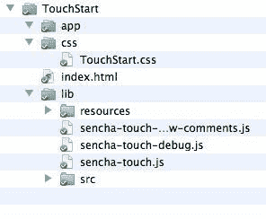
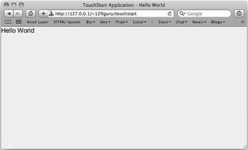
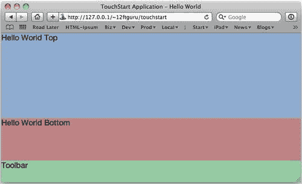
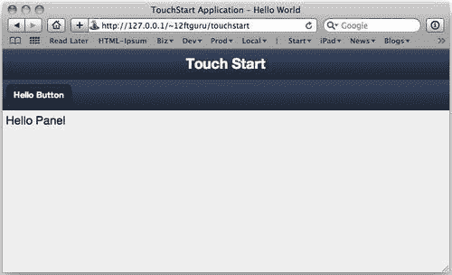
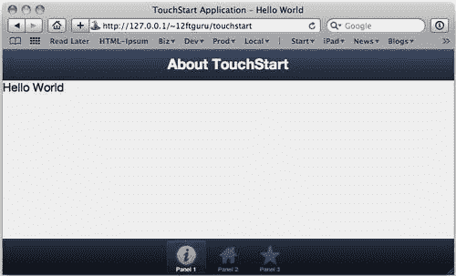
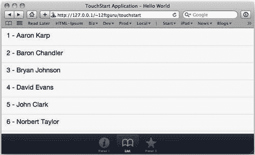
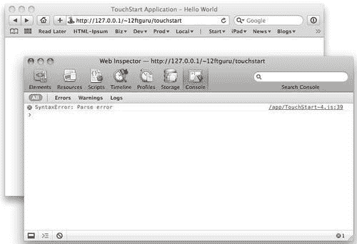
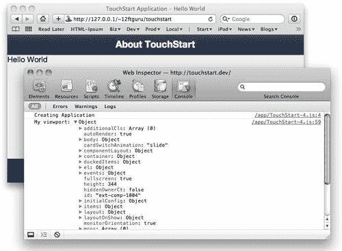
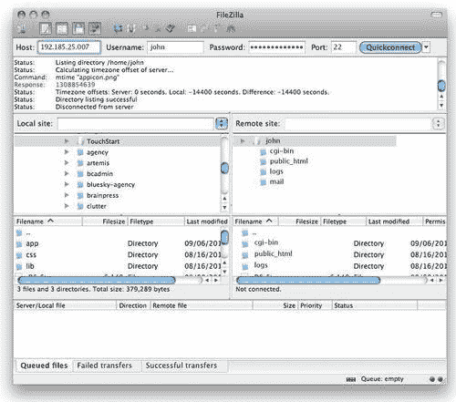

# 第二章，创建一个简单的应用程序

本章将引导您使用 Sencha Touch 创建一个简单的应用程序。我们将介绍任何 Sencha Touch 应用程序中包含的基本元素，并将介绍您可能在自己的应用程序中使用的更常见组件：容器、面板、列表、工具栏和按钮。

在本章中，我们将介绍：

*   设置文件夹结构
*   从零开始使用 TouchStart.js
*   使用布局控制容器
*   测试和调试应用程序
*   更新生产应用程序
*   将应用程序投入生产

接下来，我们将介绍如何使用各种容器来显示文本和其他项目。然后，我们将添加其他组件来创建第一个简单的应用程序。最后，我们将看一看应用程序的调试，并为您提供一些当事情发展迅速时该怎么做的指导。

# 设置文件夹结构

在开始之前，您需要确保已经正确设置了开发环境，如前一章所述。

### 提示

**根文件夹**

如前一章所述，您需要将应用程序的文件夹和文件放在本地计算机上正确的 web 服务器文件夹中。

在 Mac 上，这将是您的主文件夹中的 `Sites`文件夹。

在 Windows 上，这将是 `C:\xamp\htdocs`（假设您安装了**xampp**，如前一章所述）。

在本书的其余部分中，我们将此文件夹称为本地 web 服务器的**根文件夹**。

## 设置您的应用程序文件夹

在开始编写代码之前，我们必须执行一些初始设置，复制一些必要的资源，并创建应用程序文件夹的基本结构。本节将引导您完成 Sencha Touch 文件的基本设置、创建样式表文件夹和创建 `index.html`文件。

1.  Locate the Sencha Touch folder you downloaded in the previous chapter.

    ### 注

    本章中的代码是使用 Sencha Touch 1.1.0 编写的。

2.  在本地 web 服务器的根文件夹中创建文件夹。你可以给它取你喜欢的名字。我在本章中使用了文件夹名 `TouchStart`。
3.  在您的 `TouchStart`文件夹中创建三个名为 `lib, app`和 `css`的空子文件夹。
4.  现在，将您先前下载的 Sencha Touch 文件夹中的 `resources`和 `src`文件夹复制到 `TouchStart/lib`文件夹中。
5.  将以下文件从 Sencha Touch 文件夹复制到 `TouchStart/lib`文件夹：
    *   `sencha-touch.js`
    *   `sencha-touch-debug.js`
    *   `sencha-touch-debug-w-comments.js`
6.  在名为 `TouchStart.css`的 `TouchStart/css`文件夹中创建一个空文件。这是我们将为应用程序放置自定义样式的地方。
7.  在主 `TouchStart`文件夹中创建一个空的 `index.html`文件。我们将在下一节对此进行充实。

### 提示

**图标文件**

iOS 和 Android 应用程序都使用图像图标文件进行显示。这将创建非常圆的启动按钮，在大多数触摸式应用程序中都可以找到。

如果您计划共享应用程序，还应为启动图像和应用程序图标创建 PNG 图像文件。一般来说，有两个发布图像，一个分辨率为 320 x 460 px，用于 iPhone，另一个分辨率为 768 x 1004 px，用于 iPad。应用程序图标应为 72 x 72 px。有关详细信息，请参见苹果的*iOS 人机界面指南*，见[http://developer.apple.com/library/ios/#documentation/userexperience/conceptual/mobilehig/IconsImages/IconsImages.html](http://developer.apple.com/library/ios/#documentation/userexperience/conceptual/mobilehig/IconsImages/IconsImages.html) 。

完成后，文件夹结构应如下所示：



## 创建 HTML 应用程序文件

使用您最喜欢的 HTML 编辑器，打开我们在设置应用程序文件夹时创建的 `index.html`文件。此 HTML 文件用于指定运行应用程序所需的其他文件的链接。

以下代码示例显示 HTML 的外观：

```js
<!DOCTYPE html>
<html>
<head>
<meta http-equiv="Content-Type" content="text/html; charset=utf-8">
<title>TouchStart Application My Sample App</title>
<!-- Sencha Touch CSS -->
<link rel="stylesheet" href="lib/resources/css/sencha-touch.css" type="text/css">
<!-- Sencha Touch JS -->
<script type="text/javascript" src="lib/sencha-touch-debug.js"></script>
<!-- Application JS -->
<script type="text/javascript" src="app/TouchStart.js"></script>
<!-- Custom CSS -->
HTML application file, folder structurecreating<link rel="stylesheet" href="css/TouchStart.css" type="text/css">
</head>
<body></body>
</html>

```

### 提示

**下载示例代码**

您可以下载您在[账户购买的所有 Packt 书籍的示例代码文件 http://www.PacktPub.com](http://www.PacktPub.com) 。如果您在其他地方购买了本书，您可以访问[http://www.PacktPub.com/support](http://www.PacktPub.com/support) 并注册，将文件直接通过电子邮件发送给您。

### 提示

**评论**

在 HTML 中，`<!--`和 `-->`之间的任何内容都是注释，不会显示在浏览器中。这些注释是为了告诉您文件中发生了什么。将注释添加到您自己的文件中是一个非常好的主意，以防您稍后需要回来进行更改。

让我们逐个查看这个 HTML 代码，看看这个文件中会发生什么。

前五行只是典型网页的基本设置行：

```js
<!DOCTYPE html>
HTML application file, folder structurecreating<html>
<head>
<meta http-equiv="Content-Type" content="text/html; charset=utf-8">
<title>TouchStart Application Hello World</title>

```

除了包含标题的最后一行之外，您不需要为任何应用程序更改此代码。标题行应包含应用程序的标题。在这种情况下， `TouchStart Application Hello World`是我们的标题。

接下来的几行是我们开始加载文件以创建应用程序的地方，从 Sencha Touch 文件开始。

第一个文件是 Sencha Touch 库的默认 CSS 文件-`sencha-touch.css`。

```js
<link rel="stylesheet" href="lib/resources/css/ext-touch.css" type="text/css">

```

### 提示

**CSS 文件**

**CSS**或**层叠样式表**文件包含页面的样式信息，例如哪些项目为粗体或斜体，使用哪些字体大小，以及项目在显示器中的位置。

Sencha Touch 样式库非常庞大和复杂。它控制 Sencha Touch 中每个组件的默认显示。不应直接对其进行编辑。

下一个文件是实际的 senchatouch JavaScript 库。在开发和测试期间，我们使用 Sencha Touch 库的调试版本 `sencha-touch-debug.js:`

```js
<script type="text/javascript" src="lib/sencha-touch-debug.js"></script>

```

库的调试版本未压缩，包含注释和文档。如果发生错误，这会很有帮助，因为它允许您准确地查看库中发生错误的位置。

当您完成开发和测试后，您应该编辑此行以使用 `sencha-touch.js`。此备用文件是针对生产环境优化的库版本，使用的带宽和内存更少；但是，它没有评论，而且很难阅读。

无论是 `sencha-touch-debug.js`还是 `sencha-touch.js`文件都不应直接编辑。

接下来的两行是我们开始包含自己的应用程序文件的地方。这些文件的名称完全是任意的，只要它们与您稍后在本章下一节中创建的文件的名称相匹配。将文件命名为应用程序名通常是一个好主意，但这完全取决于您自己。在本例中，我们的文件名为 `TouchStart.js`和 `TouchStart.css`。

```js
<script type="text/javascript" src="app/TouchStart.js"></script>

```

第一个文件 `TouchStart.js`将包含我们的 JavaScript 应用程序代码。

我们需要包含的最后一个文件是我们自己的定制 CSS 文件，称为 `TouchStart.css`。此文件将包含应用程序所需的任何样式信息。它还可以用于覆盖一些现有的 Sencha Touch CSS 样式。

```js
<link rel="stylesheet" href="resources/css/TouchStart.css" type="text/css">

```

这将关闭 `index.html`文件的`</head>`区域。 `index.html`文件的其余部分包含`<body></body>`标记和结束`</html>`标记。

如果你对传统网页有任何经验，那么以这种方式使用空的`<body></body>`标签可能会有点奇怪。在传统的网页中，这是所有显示信息的正常位置。

对于我们的 Sencha Touch 应用程序，我们创建的 JavaScript 将自动填充此区域。 `index.html`文件中不需要进一步的内容，我们所有的代码都将保存在 `TouchStart.js`文件中。

所以，不要再拖延了，让我们编写一些代码吧！

# 使用 TouchStart.js 从头开始

让我们首先打开 `TouchStart.js`文件并添加以下内容：

```js
new Ext.Application({
name: 'TouchStart',
launch: function() {
var hello = new Ext.Container({
fullscreen: true,
html: '<div id="hello">Hello World</div>'
});
this.viewport = hello;
}
});

```

这可能是您可以创建的最基本的应用程序：无处不在的“Hello World”应用程序。保存代码后，使用 Safari web 浏览器导航到本地 web 服务器根文件夹中的 `TouchStart`文件夹。地址应如下所示：

*   [http://localhost/TouchStart/](http://localhost/TouchStart/) ，在电脑上
*   [http://127.0.0.1/~username/TouchStart](http://127.0.0.1/~username/TouchStart)，在 Mac 电脑上（用户名应替换为 Mac 电脑的用户名）



正如您所看到的，这段代码所做的只是创建一个包含单词**Hello World**的窗口。然而，在这个例子中有几个重要的元素需要注意。

第一行 `NewExt.Application({`为 Sencha Touch 创建了一个新的应用程序。大括号之间列出的所有内容都是此新应用程序的配置选项。虽然应用程序有许多配置选项，但大多数选项至少包括应用程序的名称和一个 `launch`函数。

### 提示

**名称空间**

使用他人代码的最大问题之一是命名问题。例如，如果您使用的框架有一个名为“Application”的对象，并且您创建了自己的名为“Application”的对象，那么这两个函数将发生冲突。JavaScript 使用名称空间的概念来防止这些冲突的发生。

在本例中，Sencha Touch 使用名称空间 `Ext`。您将在本书的整个代码中看到这个名称空间的使用。它只是一种消除框架对象和代码与您自己的对象和代码之间潜在冲突的方法。

Sencha 将自动为您自己的代码设置一个名称空间，作为新 `Ext.Application`对象的一部分。

`Ext`也是 Sencha 名为 `ExtJS`的 web 应用程序框架名称的一部分。Sencha Touch 使用相同的名称空间约定，允许熟悉一个库的开发人员轻松理解另一个库。

当我们创建一个新的应用程序时，我们需要向它传递一些配置选项。这将告诉应用程序如何查看和执行什么操作。这些配置选项包含在大括号（{}）中，并用逗号分隔。第一个选项如下：

```js
name: 'TouchStart'

```

这将应用程序的名称设置为引号之间的任何名称。此 `name`值不应包含空格，因为 Sencha 还使用此值为您自己的代码对象创建名称空间。在本例中，我们调用了应用程序 `TouchStart`。下一个选项是事情开始变得有趣的地方：

```js
launch: function() {
var hello = new Ext.Container({
fullscreen: true,
html: '<div id="hello">Hello World</div>'
});
this.viewport = hello;
}

```

`launch`配置选项实际上是一个函数，它会告诉应用程序启动后要做什么。让我们回顾一下启动配置的最后一段代码，并解释一下 `this.viewport`。

默认情况下，新应用程序具有视口。视口是应用程序的虚拟容器。在这里，您将为应用程序添加所有其他内容。通常，此视口将设置为特定类型的容器对象。

在 `launch`函数的开头，我们首先创建一个基本容器，我们称之为 `hello:`

```js
var hello = new Ext.Container({
fullscreen: true,
html: '<div id="hello">Hello World</div>'
});

```

像 `Application`类一样，一个新的 `Ext.Container`类被传递给一个配置对象，该配置对象由一组配置选项组成，包含在花括号（{}）中，并用逗号分隔。 `Container`对象有 40 多个不同的配置选项，但对于这个简单的示例，我们只使用了两个：

*   `fullscreen`设置容器的大小以填充整个屏幕（无论使用哪种设备）。
*   `html`设置容器本身的内容物。顾名思义，这可以是包含 HTML 或纯文本的字符串。

诚然，这是一个非常基本的应用程序，没有太多的风格。让我们使用容器的布局配置选项添加一些额外的内容。

### 提示

**我的申请不起作用！**

当您在编写代码时，绝对肯定会在某个时候遇到错误。即使是一个简单的错误也会导致您的应用程序以许多有趣和令人恼火的方式运行。发生这种情况时，务必记住以下几点：

*   不要惊慌。
*   回顾您的步骤，使用上一章中提到的工具跟踪错误并修复它。如果本章中的任何内容对您不起作用，请跳到本章的*测试和调试*部分，获取一些关于从何处开始查找的指针。

# 通过布局控制容器

布局为您提供了许多在容器中排列内容的选项。Sencha Touch 为容器提供了四种基本布局：

*   `fit:`单件布局，可自动展开以占据整个集装箱
*   `hbox:`在容器中水平排列物品
*   `vbox:`在容器中垂直排列物品
*   `card:`像一堆卡片一样排列项目，其中最初只有活动卡片可见

在前面的示例中，我们没有声明布局。通常，您总是希望为任何容器声明布局。如果不这样做，容器中的组件在出现时可能无法适当调整大小。当容器仅包含 HTML 时，这一点就不那么重要了。

让我们以前面的示例为例，稍微修改一下：

```js
new Ext.Application({
name: 'TouchStart',
launch: function() {
var hello = new Ext.Container({
fullscreen: true,
layout: {
type: 'vbox',
align: 'stretch'
},
items: [
{
xtype: 'container',
layouts, for containerexampleflex: 2,
html: '<div id="hello">Hello World Top</div>',
cls: 'blueBox',
border: 1
}, {
xtype: 'container',
flex: 1,
html: '<div id="hello">Hello World Bottom</div>',
cls: 'redBox',
border: 1
}, {
xtype: 'container',
height: 50,
html: '<div id="footer">Footer</div>',
cls: 'greenBox'
}
]
});
this.viewport = hello;
}
});

```

对于本例，我们删除了先前设置 HTML 的行`'<div id="hello"> Hello World</div>'`，并将其替换为布局配置：

```js
layout: {
type: 'vbox',
align: 'stretch'
}

```

此配置将我们的主容器布局设置为 `vbox`（垂直对齐的对象），并拉伸框以占据屏幕上的整个水平宽度。

在我们设置布局之后，我们还将 `items`添加到我们的容器中。这些物品是我们希望包含在容器内的 Sencha Touch 组件的集合。 `items`列表用括号括起来， `items`列表中的各个组件用大括号括起来。

在这种情况下，我们将在主容器内增加三个容器：

```js
items: [
{
xtype: 'container',
flex: 2,
html: '<div id="hello">Hello World Top</div>',
cls: 'blueBox',
border: 1
}, {
xtype: 'container',
flex: 1,
html: '<div id="hello">Hello World Bottom</div>',
cls: 'redBox',
border: 1
}, {
xtype: 'container',
height: 50,
html: '<div id="footer">Footer</div>',
cls: 'greenBox'
}
]

```

您首先会注意到的是添加了一个名为 `xtype`的配置。

在 Sencha Touch 中， `xtype: 'container'`只是表示 `new Ext.Container`的另一种方式。这是在现有容器中添加项目的一种更简单的方法，并具有节省设备内存的额外好处。几乎 Sencha Touch 中使用的每个组件都有一个独特的 `xtype`。

### 提示

**X 类型**

当您使用 `xtype`时，组件只有在实际需要显示给用户时才会创建。相反，无论何时使用 `new`命令，例如 `new Ext.Container`，组件都会立即在内存中创建。

Sencha Touch API 在[中包含可用的 `xtype`组件列表 http://dev.sencha.com/deploy/touch/docs/](http://dev.sencha.com/deploy/touch/docs/) （搜索*组件）。*

列表中的下一个配置称为 `flex`。 `flex`配置是 `hbox`和 `vbox`布局所独有的。它控制零部件在总体布局中按比例占据的空间大小。您可能还注意到最后一个容器没有 `flex`配置。相反，它有 `height: 80`。 `vbox`布局将解释这些值，以如下方式布置容器：

1.  由于我们有一个高度为 50 的组件， `vbox`布局将使该组件保持 50 像素高。
2.  `vbox`布局将使用其他两个组件的弹性值作为比率。在这种情况下，2:1。
3.  最终的结果是屏幕底部有一个 80 像素高的容器。其他两个容器将占用剩余的可用空间。顶部容器的高度也将是中间容器的两倍。

为了使这些尺寸更清晰，我们还为每个内部容器添加了一个 `cls`配置。 `cls`配置在容器上设置了一个 CSS 类，允许我们使用 `TouchStart.css`文件为每个容器添加样式更改。

找到您的 `TouchStart.css`文件，在代码编辑器中打开它，并添加以下内容：

```js
.blueBox {
background-color: #7FADCF;
}
.redBox {
background-color: #CE7E83;
}
.greenBox {
background-color: #7ECEA0;
}

```

在 Safari 中保存更改并重新加载页面：



从这个示例中可以看到，我们可以轻松地嵌套容器以创建更复杂的布局。我们还应该考虑到这样一个事实，即每个容器都可以有不同的布局，并且可以包含自己的项目。将按钮添加到底部的页脚容器中并使其成为一个真正的工作工具栏是很容易的。然而，我们真的不需要，因为 SenchaTouch 已经为我们提供了一种更简单的方法。

### 注

使用布局时需要了解的一个重要概念是，布局配置不会更改容器本身所在的位置或外观，而只会影响容器内的项目。此外，Sencha Touch 中的所有显示组件的默认布局为 `fit`。如果不指定其他布局类型，将使用 `fit`布局。我们将在本书后面深入讨论布局。

# 面板

如前所述，容器是 Sencha Touch 中的一个非常基本的对象，可以对其进行扩展以创建具有新功能的更复杂的对象。第一个是 `Panel`。

与容器一样，面板可以有 `layout, html`或 `items`组件，并且可以设置为 `fullscreen`。事实上，由于它从容器继承，它可以做容器所能做的一切，等等。

面板的主要优点之一是能够停靠项目。这些固定项目可用于制作标题栏、工具栏和导航栏。一个简单的例子如下：

```js
new Ext.Application({
name: 'TouchStart',
launch: function() {
this.viewport = new Ext.Panel({
fullscreen: true,
bodyPadding: 5,
dockedItems: [
{
dock : 'top',
xtype: 'toolbar',
title: 'Touch Start'
},
{
dock : 'top',
xtype: 'toolbar',
items: [
{
text: 'Hello Button'
}
]
}
],
html: 'Hello Panel'
});
}
});

```



这与我们的第一个示例类似，只是我们现在使用的是一个面板，我们还通过直接设置 `viewport`方法实现了一个快捷方式：

```js
this.viewport = new Ext.Panel({

```

我们还通过将 `bodyPadding`设置为 `5`为面板添加了一点视觉吸引力，以填充的形式，但最大的变化是停靠的项目。

就像我们在主容器中添加容器一样，停靠的项目显示为括号内的组件数组。在本例中，有两个项目：一个用于标题栏，另一个用于按钮栏。这两个项目都有一个 `xtype`值 `toolbar`。

`toolbar`也是从我们的老朋友——容器继承来的。这意味着它也可以有 `layout, html`和 `items`组件。作为一个 `dockedItems`组件， `toolbar`也理解它应该停靠在哪里的概念。 `dock`配置可设置为 `top, right, left`或 `bottom`。

我们的第一个工具栏只是设置一个 `title`配置值，而不是 `html`或 `items`。但是，第二个工具栏有点不同。

在第二个工具栏中，您可能会注意到一件有趣的事情，即我们的**Hello 按钮**实际上没有 `xtype`的配置值。这是因为工具栏假定其所有项目都是按钮，除非您另有说明。在这种情况下，按钮只有一个 `text`属性。此时，按钮不起任何作用，但您可以开始看到 `panel`及其 `dockedItems`组件的一些可能性。

还应注意的是， `dockedItems`组件不必是工具栏。它们实际上可以是您喜欢的任何组件。例如，如果您想要有一个左侧边栏，您可以添加一个 `xtype`值为 `Panel`且 `dock`设置为 `left`的 `dockedItem`组件，这将为您提供固定在现有面板左侧的常规面板的所有功能。

### 提示

**什么时候使用面板而不是容器？**

既然面板不仅仅是一个容器，那么合乎逻辑的问题是：为什么要使用容器？

一般的经验法则是，如果您需要额外的功能，请使用 `panel`组件，如果您不需要固定项目或标题栏，请使用 `container`组件。使用 `container`可以节省一点内存，并使代码更清晰、更易懂。

虽然该面板是启动应用程序的良好起点，但 Sencha Touch 还提供了一个更复杂的面板版本，称为 `TabPanel`。

# 选项卡面板组件

`TabPanel`组件包含常规面板的所有核心功能，但它们也有一些额外的优势。

`TabPanel`是一个非常专业的面板，它使用 `card`布局为选项卡面板中的每个项目快速创建一组可切换的选项卡。

`card`布局可以包含多个不同的容器，但一次只能显示一个。就像一副只有最上面的卡片可见的卡片一样， `card`布局一次只能有一个活动项。然后，您可以更改活动项，新卡将自动切换到前面，隐藏上一张卡。

默认情况下， `TabPanel`为其所有项目创建 `card`布局。它还为每个项目在选项卡栏中添加一个按钮。这些按钮可自动从一张卡切换到下一张卡，无需任何附加代码。



为了创建这个新的 `TabPanel`，让我们修改前面的示例。我们将把 `viewport`方法设置为一个简单的面板，而不是将其设置为一个 `TabPanel`，并将我们的旧面板放在 `TabPanel`中。我们还将添加两个空容器，以便查看选项卡的工作方式：

```js
new Ext.Application({
name: 'TouchStart',
launch: function() {
this.viewport = new Ext.TabPanel({
fullscreen: true,
cardSwitchAnimation: 'slide',
tabBar:{
dock: 'bottom',
layout: {
pack: 'center'
}
},
items: [{
xtype: 'panel',
title: 'Panel 1',
fullscreen: false,
html: '<div id="hello">Hello World</div>',
iconCls: 'info',
dockedItems: [
{
dock: 'top',
xtype: 'toolbar',
title: 'About TouchStart'
}
]
}, {
xtype: 'container',
html: 'TouchStart container 2',
iconCls: 'home',
title: 'Panel 2'
}, {
xtype: 'container',
html: 'TouchStart container 3',
iconCls: 'favorites',
title: 'Panel 3'
}]
});
}
});

```

查看代码，您可以看到 `TabPanel`有两个新的配置选项。第一个是 `cardSwitchAnimation`选项，我们将其设置为 `slide`。其他选项包括：

*   `fade`
*   `flip`
*   `cube`
*   `pop`
*   `wipe`

您还可以将其设置为 `false`，这只需在没有任何动画的情况下交换卡即可。

`TabPanel`还有一个 `tabBar`属性，其作用方式与前面示例中的 `toolbar`组件基本相同。在这个例子中，我们设置了 AUT T3^出现在底部，并且我们设置了 Tabar 的布局，将所有的按钮放在一起，在 Ty6 T6 中的中间 T5 段中。

对于 `TabPanel items`列表，我们有原始的 Hello World `panel`组件和一对简单的 `container`组件。您将看到这些项目的一个不同之处是，我们现在有了 `title`和 `iconCls`的配置选项。这两个选项控制项目选项卡上显示的内容。 `iconCls`可以设置为包含的图标之一，或者您可以自定义并包含自己的图标。

### 提示

图标

可用图标的完整列表可在**厨房水槽**应用程序（[中找到 http://dev.sencha.com/deploy/touch/examples/kitchensink/ **界面****图标**下的](http://dev.sencha.com/deploy/touch/examples/kitchensink/)。点击**源**按钮查看图标的使用方式。

现在我们有了 `TabPanel`组件，在 Safari 中加载应用程序，然后单击选项卡查看它们是如何工作的。更改 `cardSwitchAnimation`选项，然后查看其他选项的外观。您也可以尝试更改 `iconCls`的一些值。当您准备好继续前进时，我们将为我们的 `TabPanel`添加一些更有趣和更复杂的内容。

# 列表组件

Sencha Touch 中的 `list`组件允许您在列表布局中显示数据。这看起来很简单，但列表遵循的模式与前面的组件略有不同。让我们对当前代码进行一些修改，看看其中的一些差异是什么样子的。

查找包含第一个空容器的括号集：

```js
{
xtype: 'container',
html: 'TouchStart container 2',
iconCls: 'home',
title: 'Panel 2'
}

```

将整个 `container`部件（包括两端的 `{}`部件）更换为以下部件：

```js
{
xtype: 'list',
title: 'List',
fullscreen: false,
iconCls: 'bookmarks',
itemTpl: '{id} - {fullname}',
store: new Ext.data.Store({
model: 'ListItem',
data: [
{id: 1, fullname: 'Aaron Karp'},
{id: 2, fullname: 'Baron Chandler'},
{id: 3, fullname: 'Bryan Johnson'},
{id: 4, fullname: 'David Evans'},
{id: 5, fullname: 'John Clark'},
{id: 6, fullname: 'Norbert Taylor'}
]
})
}

```

我们可以看到的第一个大区别是， `list`组件没有声明布局。相反，它使用 `itemTpl`对象来控制列表中项目的排列方式。请注意，大括号中的元素`'{id} - {fullname}',`也出现在 `data`组件中，位于 `list`组件的底部。这意味着列表的每一行都将显示 ID、破折号和值。

这些 `itemTpl`布局值在 Sencha Touch 中称为**XTemplates**。XTemplates 由一个字符串组成，其中的项用大括号括起来。当列表出现时，它将打印出 XTemplates 并用数据中列出的相应值替换 `{}`中的项目。

`store`用于控制列表的数据。它可以在本地保存数据，如我们的示例中所示，也可以从服务器检索数据。商店内的数据必须符合**型号**。该模型描述了存储可用的值以及它们可能具有的任何特殊属性。

我们将在本书后面更详细地介绍 XTemplates、商店和模型。现在，我们仍然需要创建这个商店示例所需的实际模型。此时， `store`组件的 `model`配置选项设置为 `ListItem`。

在应用程序顶部，在 `launch`函数之后创建一个新行：

```js
launch: function() {

```

添加以下代码：

```js
Ext.regModel('ListItem', {
fields: [
{name: 'id', type: 'int'},
{name: 'fullname', type: 'string'}
]
});

```

这将为我们的商店创建正确的模型。该模型创建一个字段数组，每个字段都有一个名称和一个类型。该名称应与您在 `itemTpl`对象和门店 `data`对象中使用的名称相匹配。 `type`配置选项使存储了解如何处理排序或存储时的数据。

如果一切都按计划进行，您的第二个选项卡现在应该如下所示：



在这个例子的每一步中，我们都变得越来越复杂。在某个时刻，很可能是一个空屏幕而不是应用程序向您发出了欢迎。在我们走得太远之前，我们需要看看当事情变得繁荣时你应该做些什么。

# 测试和调试应用程序

在 Safari 中测试应用程序时，首先要从错误控制台开始。在**开发**菜单中，选择**显示错误控制台**。



## 解析错误

上一个屏幕截图中的错误控制台告诉我们两件非常重要的事情。首先，我们有**语法错误：解析错误**。这意味着我们在代码的某个地方做了一些浏览器不理解的事情。通常，这是如下内容：

*   忘记关闭圆括号、方括号或大括号，或添加额外的圆括号、方括号或大括号
*   配置选项之间没有逗号，或添加了额外的逗号
*   在其中一个变量声明的末尾省略分号
*   不使用右引号或双引号（必要时也不使用转义引号）

第二个关键信息位是**/app/TouchStart-4.js:39**。它告诉我们：

*   **/app/TouchStart-4.js**是发生错误的文件
*   **39**是发生错误的行

使用这些信息，我们应该能够快速跟踪错误并修复它。

## 区分大小写

JavaScript 是一种区分大小写的语言。这意味着如果您键入 `xtype: 'Panel'`，您将在错误控制台中获得以下内容：

**试图使用尚未注册的 xtype 创建组件：面板**

这是因为 Sencha Touch 期待的是 `panel`而不是 `Panel`。

## 丢失的文件

另一个常见问题是缺少文件。如果您的 `index.html`文件没有正确指向 `sencha-touch-debug.js`文件，您将得到两个单独的错误：

1.  **加载资源失败：服务器响应状态为 404（未找到）**
2.  **引用错误：找不到变量：Ext**

第一个错误是信息的关键位；浏览器找不到您试图包含的文件之一。第二个错误是由于缺少文件而导致的，只是抱怨找不到 `Ext`变量。在本例中，这是因为缺少的文件是 `sencha-touch-debug.js`，它首先设置了 `Ext`变量。

## Web 检查器控制台

Safari Web Inspector 的另一个对调试应用程序非常有用的功能是控制台。在 JavaScript 代码中，添加以下命令：

```js
console.log('Creating Application');

```

将其添加到此新应用程序行之前：

```js
new Ext.Application({

```

您应该在 Web 检查器的控制台选项卡中看到文本**创建应用程序**。您还可以将变量发送到控制台，在那里可以查看其内容，因此：

```js
console.log('My viewport: %o', this.viewport);

```



这显示了我们创建的 `TabPanel`组件，如果您将其放在 `this.viewport = new TabPanel`代码块之后。如果由于某种原因，您的组件显示不正确，这将非常有用。将对象发送到控制台可以让您看到 JavaScript 看到的对象。

### 注

如果您想了解更多有关使用 Safari Web Inspector 调试应用程序的信息，请访问苹果的*调试您的网站*页面[http://developer.apple.com/library/safari/#documentation/AppleApplications/Conceptual/Safari_Developer_Guide/DebuggingYourWebsite/DebuggingYourWebsite.html](http://developer.apple.com/library/safari/#documentation/AppleApplications/Conceptual/Safari_Developer_Guide/DebuggingYourWebsite/DebuggingYourWebsite.html) 。

# 更新生产申请

当您完成了应用程序的编写和测试，并确信它已准备好投入生产时，在将应用程序发布到野外之前，您应该采取一些简单的步骤。

## 指向生产库文件

在我们的 HTML 文件中，我们建议通过脚本标签加载文件 `sencha-touch-debug.js`。为了减少加载时间和内存使用，您应该将其更改为 `sencha-touch.js`。您可能还使用了 `sencha-touch-debug.css`文件来帮助编写您自己的自定义 CSS。这也应该改回 `sencha-touch.css`。

## 删除调试代码

您还应该检查应用程序的 JavaScript 代码，并删除任何 `console.log`行、警报或任何其他为帮助您调试错误而添加的代码。许多移动设备不理解调试代码，如果您将其保留在原位，那些理解的设备可能会表现出奇怪的行为。

### 提示

删除调试代码后，请确保再次测试应用程序，以确保没有意外删除任何其他代码。

## 多跑一英里

在将应用程序投入生产之前，您可以采取一些可选步骤。对于这样一个简单的应用程序，这些额外的步骤其实并不必要。但是，对于较大的应用程序，它们可以帮助您加快应用程序的速度并减少其下载大小：

1.  通过工具最小化 JavaScript 和 CSS，例如 YUI 压缩器（[http://developer.yahoo.com/yui/compressor/](http://developer.yahoo.com/yui/compressor/) 或谷歌的迷你（[http://code.google.com/p/minify/](http://code.google.com/p/minify/) ），以减小文件大小。
2.  Combine your separate graphics files into sprites to reduce load time.

    ### 注

    以下是可帮助您从图像文件创建精灵的工具：

    *   SpriteMe-[http://spriteme.org/](http://spriteme.org/)
    *   CSS 精灵创建者-[http://www.floweringmind.com/sprite-creator/](http://www.floweringmind.com/sprite-creator/)
3.  准备应用程序图标：创建一个 72px x 72px PNG 文件。将以下内容添加到您的 `index.html`文件的`<head>`元素中：`<link rel="apple-touch-icon" href="icon.png"/>.`

### 注

苹果在[上有一份文件解释了为你的应用程序创建图标的指南 http://developer.apple.com/library/ios/#documentation/userexperience/conceptual/mobilehig/IconsImages/IconsImages.html](http://developer.apple.com/library/ios/#documentation/userexperience/conceptual/mobilehig/IconsImages/IconsImages.html) 。

# 将应用程序投入生产

现在，您已经编写并测试了应用程序，并为生产做好了准备，现在是时候为它找一个合适的地方了。由于将应用程序投入生产的方法将根据您的设置而有所不同，因此我们将非常笼统地介绍此任务。

首先要做的是熟悉将应用程序投入生产的三个基本难题：**web 托管、文件传输**和**文件夹结构。**

虽然可以在本地 web 服务器上开发应用程序，但如果您想让其他人看到它，则需要一个公共可访问的 web 服务器，并保持与 Internet 的连接。有大量的 web 托管提供商，如*GoDaddy、HostGator、Blue Host、HostMonsteror*和*RackSpace*。

因为我们的应用程序是纯 HTML/JavaScript/CSS，所以您的 web 托管帐户不需要任何花哨的附加组件，例如数据库或服务器端编程语言（PHP 或 Java）。任何可以提供 HTML 页面的帐户都足够好了。这一决策的关键应该是客户支持。在选择提供商之前，请确保查看评论。

托管提供商还将提供有关设置域和将文件上载到 web 服务器的信息。请务必妥善记录您的用户名和密码，以备将来参考。

为了将您的应用程序复制到您的 web 托管帐户，您可能需要熟悉一个**FTP****（文件传输协议）**程序，例如**FileZilla**。与主机提供商一样，FTP 程序也有很多选择。它们大多数遵循一些基本惯例。

首先，您需要使用 FTP 程序连接到 web 服务器。您将需要：

*   web 服务器的名称或 IP 地址
*   您的网站托管用户名和密码
*   web 服务器的连接端口

您的网络托管提供商应在您注册时向您提供此信息。



连接到服务器后，您将看到本地计算机上的文件列表和远程 web 服务器上的文件列表。您需要移动远程服务器上的**TouchStart**文件才能上传。您的托管提供商还将为您提供这些文件需要存放的特定文件夹的名称。该文件夹通常被称为类似于**httpd、htdocs、html**或**public_html**的东西。

这就引出了上传文件的最后一个考虑事项：文件夹路径。

文件夹路径影响应用程序定位其文件和资源的方式。将应用程序上载到远程 web 服务器时，可能会影响应用程序中文件夹的显示方式。如果您有从绝对路径引用的任何文件，例如[http://127.0.0.1/~12ftguru/TouchStart/myfile.js](http://127.0.0.1/~12ftguru/TouchStart/myfile.js)，则当您将内容移动到 web 服务器时，该文件将无法工作。

当您将文件传输到远程服务器时，即使是相对 URL 也会出现问题。例如，如果您有一个使用路径 `/TouchStart/myFile.js`的文件，并且您上载的是 `TouchStart`文件夹的内容而不是文件夹本身，则文件路径将不正确。

如果您发现自己丢失了图像或出现其他错误，请记住这一点。

同样，您的 web 托管提供商是您获取信息的最佳资源。请务必查找*入门*文档，不要害怕向您的托管提供商可能拥有的任何用户论坛寻求帮助。

# 总结

在本章中，我们创建了第一个简单的应用程序。我们展示了 Sencha Touch 组件的一些基础知识，包括组件之间的配置和嵌套。我们讨论了 `panel`和 `container`组件之间的差异，以及何时选择一个组件而不是另一个组件；我们还向您介绍了 `TabPanel`和 `list`组件。此外，我们还解释了一些基本的调试方法，并为生产准备了应用程序。

在下一章中，我们将通过使用 SASS 和 Sencha Touch 库的样式工具为我们的应用程序创建自定义主题。