# 第三章：用户界面的设计

现在我们有了一个基本的应用来构建，我们将看一看可以用来定制应用的一些不同的视觉元素。在本章中，我们将：

*   仔细查看工具栏和按钮，使用布局、附加样式和图标来增强用户界面的视觉吸引力
*   扩展我们以前关于图标的工作，包括制作自己的自定义图标和使用 base64 在样式表中包含图标，而不使用实际的图像文件
*   讨论使用不同设备和屏幕尺寸时的注意事项和快捷方式
*   探索功能强大的 Sencha 主题引擎，使用 SASS 和 Compass，使用简单的 CSS 样式命令创建复杂的视觉外观

# 造型组件与主题

在我们进入本章之前，重要的是要充分理解为单个组件设计样式和创建主题之间的区别。

几乎 Sencha Touch 中的每个显示组件都可以设置自己的样式。例如， `panel`组件可以这样使用样式：

```js
{
xtype: 'panel',
style: 'border: none; font: 12px Arial black',
html: 'Hello World'
}

```

我们还可以为组件设置样式类，并使用外部 CSS 文件定义该类，如下所示：

```js
{
xtype: 'panel',
cls: 'myStyle',
html: 'Hello World'
}

```

这些是控制单个组件显示的非常有用的选项。还有一些样式元素，例如边框、填充和边距，可以直接在组件的配置中设置：

```js
{
xtype: 'panel',
bodyMargin: '10 5 5 5',
bodyBorder: '1px solid black',
bodyPadding: 5,
html: 'Hello World'
}

```

这些配置可以接受应用于所有方面的数字或 CSS 字符串值，例如， `1pxsolidblack`或 `10555`。输入的数字应不带引号，但 CSS 字符串值必须在引号内。

这些小的改变可以帮助你设计应用的样式，但是如果你需要做一些更大的事情呢？如果要更改整个应用的颜色或外观，该怎么办？如果要为按钮创建自己的默认样式，该怎么办？

这就是主题和 UI 风格发挥作用的地方。我们将首先看看 UI 样式，然后看看如何扩展这个概念，为我们的应用创建一个整体主题。

# 工具栏和按钮的 UI 样式

让我们再看一看我们在上一章中创建的简单应用，并使用它开始探索带有工具栏和按钮的样式。

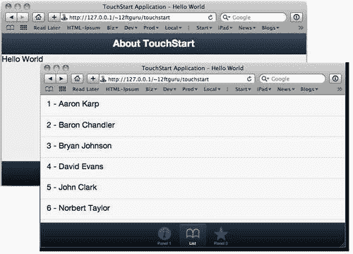

为了开始探索样式，我们将向应用添加第二个上部工具栏。找到上一个示例中代码的 `dockedItems`部分：

```js
dockedItems: [
{
dock: 'top',
xtype: 'toolbar',
title: 'About TouchStart'
}
]

```

在第一个工具栏的尾部大括号之后，让我们添加第二个工具栏，如下所示：

```js
{
dock: 'top',
xtype: 'toolbar',
title: 'About TouchStart'
}, {
dock: 'top',
xtype: 'toolbar',
items: [
{text: 'My Button'}
]
}

```

不要忘记在两个工具栏之间添加逗号。

### 提示

**额外或缺少逗号**

在 Sencha Touch 中工作时，解析错误最常见的原因之一是多余或缺少逗号。当您在移动代码时，始终确保您已经考虑了任何游离的或丢失的逗号。幸运的是，Safari 错误控制台通常会让我们很好地了解这些类型的解析错误的行号。

当您查看新工具栏时，您将看到，由于它没有标题，因此它比它上面的工具栏略短。标题使顶部的工具栏看起来比另一个工具栏大一点。您可以通过向工具栏添加 `height`配置来控制工具栏的高度，如下所示：

```js
{
dock: 'top',
xtype: 'toolbar',
height: 25,
items: [
{text: 'My Button'}
]
}

```

`height`配置使用一个数字（不带引号）来确定工具栏的高度。您可以根据自己的喜好调整此数字。

这两个工具栏加在一起也显得有点暗，因此我们将使用 `ui`配置选项更改底部工具栏的外观：

```js
{
dock: 'top',
xtype: 'toolbar',
ui: 'light',
items: [
{text: 'My Button'}
]
}

```

工具栏 UI 有两个初始值： `dark`和 `light. dark`是默认值（由上工具栏使用）。在 Safari 中保存和重新加载页面时，应该会看到上下工具栏之间的对比。

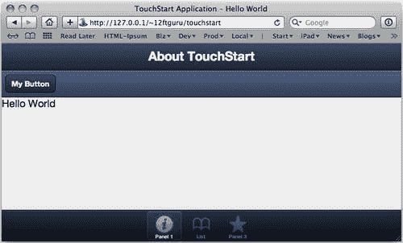

## 造型按钮

按钮也有 `ui`配置设置，但有不同的选项：

*   `normal:`默认按钮
*   `back:`左侧窄到一点的按钮
*   `round:`一个更大的圆形按钮
*   `small:`一个更小的按钮
*   `action:`默认按钮的更亮版本
*   `forward:`右边窄到一点的按钮

按钮的 `ui`选项中还内置了一些颜色选项。这些颜色选项是 `confirm`和 `decline`。这些选项使用连字符与以前的形状选项组合。例如， `confirm-small`或 `decline-round`。

让我们添加一些新按钮，看看这是什么样子。使用我们的按钮在第二个工具栏中找到 `items`列表：

```js
items: [
{text: 'My Button'}
]

```

将旧的 `items`列表替换为以下新的 `items`列表：

```js
items: [
{
text: 'Back',
ui: 'back'
}, {
text: 'Round',
ui: 'round'
}, {
text: 'Small',
ui: 'small'
}, {
text: 'Normal',
ui: 'normal'
}, {
text: 'Action',
ui: 'action'
}, {
text: 'Forward',
ui: 'forward'
}
]

```

由于按钮实际上可以在任何地方使用，我们还可以在 `panel`容器中添加一些按钮，这样我们就可以看到 `ui`选项、 `confirm`和 `decline`是什么样子的。在我们的第一个面板中找到以下行：

```js
html: '<div id="hello">Hello World</div>',

```

在该行下方添加以下内容：

```js
items: [
{
xtype: 'button',
text: 'Confirm',
ui: 'confirm',
width: 100
}, {
xtype: 'button',
text: 'Decline',
ui: 'decline',
width: 100
}
],

```

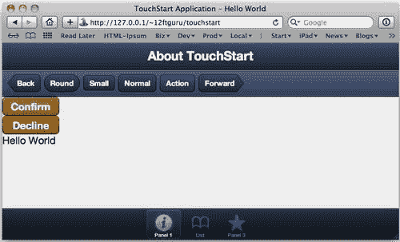

在我们的面板按钮中，您可能会注意到两件与工具栏按钮不同的事情。首先，我们在面板中声明 `xtype:'button'`，但在工具栏中没有声明。这是因为工具栏假定它将包含按钮，并且只有在使用按钮以外的内容时才需要声明 `xtype`。面板没有设置默认的 `xtype`属性，所以面板中的每个项目都必须声明一个。

第二个区别是我们为按钮声明了 `width`。如果我们在面板中使用按钮时不声明 `width`，它将扩展到面板的全宽。在工具栏上，按钮会自动调整自身大小以适合文本。

这些简单的样式选项可以帮助您的应用更易于导航，并为用户提供重要或潜在破坏性操作的视觉线索。

## 选项卡栏

与工具栏一样，底部的选项卡栏也理解 `light`和 `dark`的 `ui`配置选项。但是，选项卡栏也会根据 `ui`选项更改图标外观； `light`工具栏将有黑色图标， `dark`工具栏将有浅色图标。

这些图标实际上是黑白图像，用于在选项卡栏的颜色上创建遮罩。在本章后面，我们将向您展示如何创建自己的图标遮罩并将其集成到应用中。

在讨论图标的同时，我们还应该看看您希望在应用中包含的基本图标。

# 森查触摸主题

Sencha Touch 中的主题是快速改变应用整体外观的强大方式。我们将在本章稍后介绍安装过程，但在开始之前，我们确实需要做一些基础工作。有很多概念性的信息需要涵盖，但是您获得的灵活性非常值得您付出努力。

我们需要介绍的第一件事是对 Sencha Touch 使用的工具的基本概述，这些工具使您的应用主题化成为可能：SASS 和 Compass。

### 注

如果您已经熟悉 SASS 和 Compass，或者您更愿意先安装，然后再介绍概念，您可以跳到*设置 SASS 和 Compass*部分。

## SASS 和 Compass 简介

**SASS**代表**语法上非常棒的样式表，**用于扩展标准 CSS，以允许变量、嵌套、混合和选择器继承。这意味着您所有的常规 CSS 声明都可以正常工作，但您也可以得到一些额外的好处。

### SASS 中的变量

变量允许您定义特定的值，然后在整个样式表中使用它们。变量的名称是任意的，以 `$`开头。例如，我们可以使用 SASS 定义以下内容：

```js
$blue: #4D74C1;
$red: #800000;
$baseMargin: 10px;
$basePadding: 5px;

```

然后，我们可以在 SASS 文件中使用这些变量作为标准 CSS 声明的一部分：

```js
.box1 {
border: 1px solid $blue;
padding: $basePadding;
margin: $baseMargin;
}

```

我们还可以使用基本的数学函数，如下所示：

```js
.box2 {
border: 1px solid $blue;
padding: $basePadding * 2;
margin: $baseMargin / 2;
}

```

这将创建一个具有两倍于第一个长方体的填充和一半边距的长方体。这对于创建灵活、可伸缩的布局非常有用。通过更改基本值，您可以快速扩展应用以处理多个具有多个分辨率和屏幕大小的设备。

此外，当您决定要更改正在使用的蓝色的色调时，您只需在一个位置进行更改。SASS 还具有许多用于调整颜色的内置功能，例如：

*   `darken:`使颜色按百分比变暗
*   `lighten:`使颜色按百分比变浅
*   `complement:`返回补色
*   `invert:`返回反转的颜色
*   `saturate:`将颜色饱和一个数值
*   `desaturate:`以数字量降低颜色饱和度

这些功能允许您执行以下操作：

```js
.pullQuote {
border: 1px solid blue;
color: darken($blue, 15%);
}

```

还有用于数字、列表、字符串和基本 if-then 语句的函数。这些函数有助于使样式表和编程代码一样灵活。

### 提示

**SASS 功能，**

SASS 功能的完整列表见[http://sass-lang.com/docs/yardoc/Sass/Script/Functions.html](http://sass-lang.com/docs/yardoc/Sass/Script/Functions.html) 。

### SASS 中的混合物

**混合**是标准 SASS 变量的变体。避免简单地声明单个一对一变量，例如：

```js
$margin: 10px;

```

相反，您可以使用 mixin 将整个 CSS 类声明为变量：

```js
@mixinbaseDiv {
border: 1px solid #f00;
color: #333;
width: 200px;
}

```

然后，您可以获取该 mixin 并在 SASS 文件中使用它：

```js
#specificDiv {
padding: 10px;
margin: 10px;
float: right;
@includebaseDiv;
}

```

这将为您提供 `baseDivmixin`组件的所有属性，以及您在 `#specificDiv`类中声明的特定样式。

您还可以将 mixin 设置为使用参数，使其更加灵活。让我们看一下之前的另一个版本：

```js
@mixinbaseDiv($width, $margin, $float) {
border: 1px solid #f00;
color: #333;
width: $width;
margin: $margin;
float: $float;
}

```

这意味着我们可以设置宽度、边距和浮点值，作为 SASS 代码的一部分，例如：

```js
#divLeftSmall {
@includebaseDiv(100px, 10px, left);
}
#divLeftBig{
@includebaseDiv(300px, 10px, left);
}
#divRightBig {
@includebaseDiv(300px, 10px, right);
}
#divRightAlert {
@includebaseDiv(100px, 10px, right);
color: #F00;
font-weight: bold;
}

```

这给了我们四个属性稍有不同的 `div`标记。它们都共享 `mixinbaseDiv`类的相同基本属性，但 `width`和 `float`的值不同。我们还可以覆盖 `mixinbaseDiv`的值，在包含 mixin 之后添加它们，如 `#divRightAlert`示例所示。

### 在 SASS 中筑巢

SASS 还允许嵌套 CSS 声明。这不仅可以让您编写更接近 HTML 结构的样式，还可以生成更干净、更易于维护的代码。

在 HTML 中，我们经常将元素嵌套在另一个元素中，以使文档具有结构。一个常见的例子是包含多个列表项的无序列表，例如：

```js
<ul>
<li>Main List Item 1</li>
<li>Main List Item 2</li>
</ul>

```

通常，要通过 CSS 设置此列表的样式，您需要分别为 `ul`元素和 `li`元素编写规则。这两条规则在 CSS 文件中可能彼此不太接近，这使得调试或修改样式更加困难。

在 SASS 中，我们可以编写以下内容：

```js
ul {
width: 150px;
border: 1px solid red;
li {
margin: 1px;
border: 1px solid blue;
}
}

```

看看我们如何在 `ul?`的样式声明中嵌套 `li`元素的样式声明，这不仅与 HTML 文档的结构匹配，而且当您想要更新 `li`元素时，您知道它可以在 `ul`元素中找到。

使用 SASS 编译时，生成的 CSS 对 `ul`和 `li`元素有单独的规则：

```js
ul {
width: 150px;
border: 1px solid red;
}
ul li {
margin: 1px;
border: 1px solid blue;
}

```

如果要在浏览器中查看此列表，您将看到一个列表，其周围有红色边框，每个列表项周围有蓝色边框。

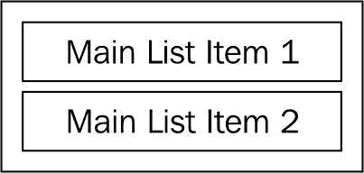

也可以通过符号（&）在嵌套中向上一级引用项。当向嵌套元素添加悬停状态之类的内容时，或者更一般地说，将规则的异常分组在一起时，这非常有用。

假设我们想在将鼠标悬停在 `li`元素上时更改背景色。我们可以在 `li`样式声明中添加`&:hover`：

```js
ul {
width: 150px;
border: 1px solid red;
li {
margin: 1px;
border: 1px solid blue;
&:hover {
background-color: #B3C6FF;
}
}
}

```

SASS 编译器将`&:hover`翻译成 `li:hover`：

```js
ulli:hover {
background-color: #B3C6FF;
}

```

`&`特殊字符也不必在规则开头使用。假设您的设计师让您的 `li`元素在位于特殊 `#sidebardiv`组件中时使用更大的边框。您可以在 `ul/li`规则之后编写单独的规则，也可以使用特殊的`&`字符在 `li`规则集中添加异常：

```js
ul {
li {
margin: 1px;
border: 1px solid blue;
&:hover {
background-color: #B3C6FF;
}
div#sidebar& {
border-width: 3px;
}
}
}

```

这将转换为以下规则：

```js
div#sidebarul li { border-width: 3px; }

```

您还可以嵌套 CSS 名称空间。在 CSS 中，如果所有属性都以相同的前缀开头，例如 `font-`，那么您也可以嵌套它们：

```js
li {
font: {
family: Verdana;
size: 18px;
weight: bold;
}
}

```

请务必记住将冒号放在名称空间名称之后。编译后，它将变成以下内容：

```js
li {
font-family: Verdana;
font-size: 18px;
font-weight: bold;
}

```

这适用于任何名称空间 CSS 属性，例如， `border-`或 `background-`。

### SASS 中的选择器继承

SASS 中的选择器继承类似于 JavaScript 中的对象继承。同样地， `panel`组件扩展了 `container`对象，这意味着 `panel`具有 `container`的所有属性和功能，然后是一些。SASS 允许您拥有继承其他对象样式的对象。

假设我们要为应用创建一些消息框元素，一个用于信息消息，一个用于错误。首先，我们应该定义一个通用框：

```js
.messageBox {
margin: 10px;
width: 150px;
border: 1px solid;
font: {
size: 24px;
weight: bold;
}
}

```

现在，在我们想要包含 `.messageBox`样式的任何类中，我们只使用 `@extend`指令 `@extend.messageBox`；，单独一行：

```js
.errorBox {
@extend .messageBox;
border-color: red;
color: red;
}
.infoBox {
@extend .messageBox;
border-color: blue;
color: blue;
}

```

然后，在我们的 HTML 中，我们将只使用 `.errorBox`和 `.infoBox`类：

```js
<div class="infoBox">Here's some information you may like to have.</div>
<div class="errorBox">An unspecified error has occurred.</div>

```

把它们放在一起，你会看到左边的框，有蓝色的边框和蓝色的文本。右框将具有红色边框和红色文本：

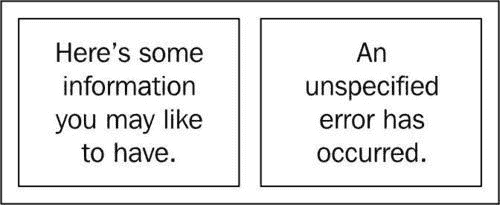

### 罗盘

正如 SenchaTouch 是一个基于 JavaScript、CSS 和 HTML 等低级语言构建的框架一样，Compass 也是一个基于 SASS 和 CSS 构建的框架。Compass 提供了一套可重用组件，用于设置应用的样式，例如：

*   **CSS 重置**，这在所有主要 web 浏览器中强制大多数 HTML 具有统一的外观。
*   **Mixins**，允许您为 CSS 声明复杂的编程函数。
*   **布局和网格**，强制执行宽度和高度标准，以帮助在所有页面上保持布局一致。
*   **图像精灵，**允许您从多个较小的图像中自动生成单个图像（这便于浏览器下载）。CSS 将自动显示您需要的图像部分，隐藏其余部分。
*   **文本替换**，允许您自动交换文档中的特定文本片段。
*   **排版**，为在网页中使用字体提供高级选项。

Compass 还将最新的 CSS 最佳实践集成到其组件中，这意味着您的样式表将更加精简和高效。

### SASS+指南针=主题

Sencha Touch 主题通过提供特定于 Sencha Touch 功能的变量和混音，将 SASS 和 Compass 进一步推向前进。senchatouch 的 JavaScript 部分生成许多非常复杂的 HTML，以便显示各种组件，例如工具栏和面板。您不必学习 SenchaTouch 使用的所有复杂类和 HTML 技巧，只需使用适当的 mixin 即可更改应用的外观。

# 设置 SASS 和指南针

如果您决定创建自己的 Sencha Touch 主题，则必须同时安装 SASS 和 Compass，它们是 Sencha Touch 的独立库。

安装 SASS 和 Compass 需要我们在命令行上做一些工作。由于 SASS 和 Compass 都以**RubyGems**的形式提供，Windows 用户首先需要安装**Ruby**。

## 安装 Ruby

Mac 用户可以休息一下，因为 Ruby 已经默认安装在 OSX 上了。Windows 用户应从[下载 Ruby 安装程序 http://rubyinstaller.org/](http://rubyinstaller.org/) 。（我们推荐版本 1.9.2.

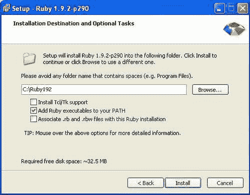

运行安装程序并按照屏幕上的说明安装 Ruby。确保选中写着**将 Ruby 可执行文件添加到路径**的框。这将节省您以后在命令行上键入的大量内容。

安装完成后，通过进入**启动****运行**，键入**cmd**，然后按*进入*，在 Windows 中打开命令行。这将打开命令行。

现在，试着输入**ruby-v**。您应该看到如下内容：

```js
C:\Ruby192>ruby -v
ruby 1.9.2p180 (2011-02-18) [i386-mingw32] 

```

这意味着 Ruby 安装正确。

## 安装 SASS 和罗盘

Mac 和 Windows 用户安装 SASS 和 Compass 的说明略有不同。

Mac 用户需要打开 `Terminal`应用并键入以下内容：

```js
sudo gem install haml
sudo gem install compass 

```

您需要使用用户名和密码进行身份验证才能完成安装。

Windows 用户需要打开命令行并键入以下内容：

```js
gem install haml
gem install compass 

```

一旦安装完成，我们就可以设置文件夹并开始使用 SASS 和 Compass。

### 注

如果您不熟悉这些命令行内容，有两个应用可以为您捆绑 Ruby、SASS 和 Compass，并在 Windows 和 OSX 上运行：

*   童子军：[http://mhs.github.com/scout-app/](http://mhs.github.com/scout-app/)
*   Compass.app:[http://compass.handlino.com/](http://compass.handlino.com/)

# 创建自定义主题

接下来我们需要做的是创建我们自己的主题 SCSS 文件。在**TouchStart/lib/resources/sass**中找到 `sencha-touch.scss`文件，并复制该文件。将文件的新副本重命名为**myTheme.scss**。

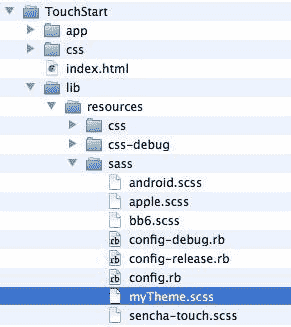

现在，我们需要告诉索引寻找我们的新主题。使用前面的示例文件，打开您的 `index.html`文件，并找到显示以下内容的行：

```js
<link rel="stylesheet" href="lib/resources/css/sencha-touch.css" type="text/css">

```

将我们的 `index.html`文件中的 `sencha-touch.css`样式表引用更改为指向 `myTheme.css:`

```js
<link rel="stylesheet" href="lib/resources/css/myTheme.css" type="text/css">

```

### 提示

SCSS 和 CSS

请注意，我们当前包含了一个来自 `css`文件夹的样式表，名为 `sencha-touch.css`，并且在 `scss`文件夹中有一个匹配的文件，名为 `sencha-touch.scss`。编译 SCSS 文件时，它会在您的 `css`文件夹中创建一个新文件。此新文件的后缀将为 `.css`而不是 `.scss`。

`.scss`是 SASS 文件的文件扩展名。**SCSS**是**Sassy CSS 的缩写。**

现在我们有了我们的路径，让我们看看我们制作的主题文件副本。打开你的 `myTheme.scss`文件。您应该看到以下内容：

```js
@import 'sencha-touch/default/all';
@includesencha-panel;
@includesencha-buttons;
@includesencha-sheet;
@includesencha-picker;
@includesencha-tabs;
@includesencha-toolbar;
@includesencha-toolbar-forms;
@includesencha-carousel;
@includesencha-indexbar;
@includesencha-list;
@includesencha-list-paging;
@includesencha-list-pullrefresh;
@includesencha-layout;
@includesencha-form;
@includesencha-msgbox;
@includesencha-loading-spinner;

```

此代码获取所有默认的 Sencha Touch 主题文件，并将它们编译为位于 `css`文件夹中的新 CSS 文件。如果打开 `lib/resources/css`文件夹中的 `sencha-touch.css`文件，您将看到我们之前使用的压缩 CSS 文件。这个文件相当大，但都是从基本命令创建的。

最好的部分是，我们现在可以用一行代码更改应用的整个配色方案。

## 基色

Sencha Touch 主题的关键变量之一是 `$base_color`。这种颜色及其变化贯穿整个主题。为了了解我们的意思，让我们将主题的颜色更改为漂亮的森林绿色，方法是在 `myTheme.scss`文件的顶部添加以下内容（最重要的是其他文本）：

```js
$base_color: #546346;

```

接下来，我们需要重新编译 SASS 文件以创建样式表。从命令行，您需要切换到 `myTheme.scss`文件所在的 `sass`文件夹。进入文件夹后，在命令行中键入以下内容并点击*输入：*

```js
compass compile

```

这将用新的 `$base_color`值更新我们的 `myTheme.css`文件。在 Safari 中重新加载页面，您的应用将看到一个全新的绿色森林外观。

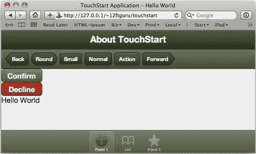

请注意，这一行代码为深色和浅色工具栏创建了变体。更改基础颜色也会更改底部选项卡栏的图标。

这一切都很酷，但是如果我们想调整主题的各个部分呢？Sencha Touch themes 使用 mixin 和 `ui`配置选项提供我们所需的内容。

### 提示

`compass compile`对 `compass watch`

Compass 使用 `compile`命令根据您的 SCSS 文件创建新的样式表。不过，您也可以将 Compass 设置为监视特定文件的更改，并在添加任何新内容时自动编译。此命令在命令行中输入如下：

```js
compass watch filename

```

### 提示

只要终端打开，此命令将保持激活状态。关闭“终端”窗口后，需要再次运行该命令，以使 Compass 监视更改。

## 混搭和 UI 配置

正如我们前面提到的，Sencha 主题系统是一组预定义的 mixin 和变量，它们被编译以创建 CSS 样式表。每个组件都有自己的混合项和用于控制样式的变量。这意味着您可以覆盖这些变量，或者使用 mixin 自定义您自己的主题。

您还可以使用 mixin 为 `ui`配置选项创建附加选项（除了我们前面看到的简单 `light`和 `dark`值）。例如，我们可以通过在 `myTheme.sass`文件中添加新的 mixin 来修改工具栏的颜色。

在 `myTheme.sass`文件中，找到表示以下内容的行：

```js
@import 'sencha-touch/default/all';

```

在该行之后，添加以下内容：

```js
@includesencha-toolbar-ui('subnav', #625546, 'matte');

```

此代码告诉 SASS 为工具栏创建一个新的 `ui`选项。我们的新选项将被称为 `subnav`，它的基色为 `#625546`。最后一个选项设置渐变的样式。可用的样式有：

*   `flat:`无梯度
*   `matte:`微妙的梯度
*   `bevel:`中等坡度
*   `glossy:`玻璃风格的渐变
*   `recessed:`反向梯度

保存文件后，需要使用命令行上的 `compass compile`命令重新编译样式表。

我们还需要更改 JavaScript 文件中的 `ui`配置选项。在 `app`文件夹中找到您的 `touchStart.js`文件并将其打开。找到应用中的第二个工具栏，就在我们添加按钮的上方。它应该如下所示：

```js
dock: 'top',
xtype: 'toolbar',
ui: 'light'

```

您需要将 `ui:'light'`更改为 `ui:'subnav'`并保存文件。

然后可以重新加载页面以查看所做的更改。

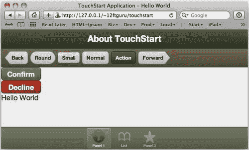

## 新增图标遮罩

您还可以使用 mixin，使用 `pictos-iconmaskmixin`组件将自定义图标掩码添加到底部的选项卡栏中。使用此函数时，需要记住两个注意事项。

首先，这些图标被用作按钮的遮罩。这意味着图标是一个仅使用黑色的透明 PNG 文件。然后，该图标用于通过任何黑色区域显示特定的颜色，从而显示特定的颜色。例如，在下面的屏幕截图中，信息掩码的实际 PNG 文件位于最左侧。根据选项卡的 `ui`配置，它可以以多种不同的颜色出现，如下所示：


原始 PNG 文件也比我们的主题项目大，这允许文件被缩放以适应不同的大小。

使用 `pictos-iconmaskmixin`组件的第二个考虑因素是，它希望图标文件位于特定文件夹 `/lib/resources/themimg/default/pictos`中。如果打开此文件夹，您将看到文件夹中已经有许多额外的图标。

例如，我们有一个名为“bolt”的图标，但如果我们试图将其作为 `touchStart.js`文件的一部分使用，我们最终会得到一个空白的正方形，而不是图标。我们需要使用 mixin 将其添加到我们的 SCSS 和 CSS 文件中。

在您的 `myTheme.sass`文件中，找到显示以下内容的行：

```js
@import 'sencha-touch/default/all';

```

在该行之后，添加以下内容：

```js
@includepictos-iconmask('bolt');

```

在本例中，我们告诉 mixin 为 `bolt.png`图标文件包含一个图标掩码。mixin 的参数始终是不带 `.png`扩展名的文件名。这也是我们将用于向 JavaScript 文件添加图标的名称。

在 `touchStart.js`文件中，找到表示以下内容的行：

```js
iconCls: 'info',

```

将该管路更换为以下部件：

```js
iconCls: 'bolt',

```

保存更改并重新加载页面以查看新图标。不要忘记在命令行上使用 `compass compile`重新编译 SASS 文件。

您也可以将自己的自定义掩码文件添加到此文件夹并调用它们，使用 SASS 文件中相同的 `pictos-iconmaskmixin`功能，并将相应的 `iconCls`配置选项添加到 `js`文件中。只需确保它们是带有黑色图标的透明 PNG 文件，并将它们放在正确的文件夹中，即 `/lib/resources/themimg/default/pictos`。

## 变量

变量也可用于每个组件，用于控制特定的颜色、大小和外观选项。与 mixin 不同，变量针对组件的单个设置。例如， `button`组件包括以下变量：

*   `$button-gradient:`所有按钮的默认渐变
*   `$button-height:`所有按钮的默认高度
*   `$button-radius:`所有按钮的默认边框半径
*   `$button-stroke-weight:`所有按钮的默认边框厚度

还有一些变量用于禁用所有按钮（渐变、文本阴影和下拉阴影）上的所有特殊 CSS 效果，以及设置工具栏图标的默认大小。

例如，如果我们添加了 `$button-height: 2em`；到我们的 `myTheme.scss`文件，然后我们可以重新编译并看到工具栏中的按钮现在比以前更大。

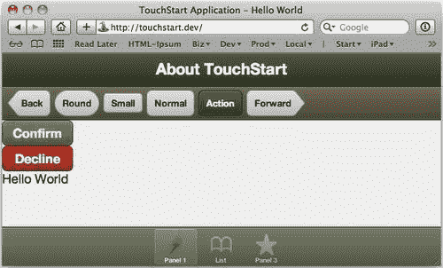

您还会注意到我们的**确认**和**拒绝**按钮没有改变大小。这是因为它们的 UI 配置`(confirm`和 `decline)`已经分别定义，并且包含特定的高度。如果要更改这两个按钮的大小，则需要删除这两个按钮的 UI 配置。

## 更多 SASS 资源

使用 senchatouch 主题中包含的 mixin 和变量，您可以更改界面的几乎任何方面，使其看起来完全符合您的需要。有许多在线资源可以帮助您深入挖掘 SASS 和 Compass 的所有可能性。

### 提示

**额外资源**

*   有关 Sencha Touch 主题混合和变量的完整列表，请访问[http://dev.sencha.com/deploy/touch/docs/theme/](http://dev.sencha.com/deploy/touch/docs/theme/)
*   在[了解更多关于 SASS 的信息 http://sass-lang.com/](http://sass-lang.com/)
*   Compass 主页上有使用 Compass 的网站示例、教程、帮助等，网址为[http://compass-style.org/](http://compass-style.org/)

# 多设备设计

在为应用创建样式表时，考虑应用在多个设备上的外观也是很重要的。每个设备都有自己的屏幕大小，这限制了应用的可用区域。

我们真正需要的是一种确定我们使用的设备类型的方法。我们可以通过使用 Sencha Touch `is`功能来实现这一点。对于以下参数， `is`函数只返回 `true`或 `false`：

*   `Android`
*   `Blackberry`
*   `Desktop`
*   `Linux`
*   `Mac`
*   `Phone`
*   `Tablet`
*   `Windows`
*   `iOS`
*   `iPad`
*   `iPhone`
*   `iPod`

您还可以使用 standalone 来检测应用是否已保存到主屏幕。例如，如果要检查屏幕大小，可以使用以下内容：

```js
if(Ext.is.Tablet || Ext.is.Desktop) {
// use full size elements here
} else {
// use phone size elements here
}

```

基本上，这段代码检查应用是否在平板电脑或桌面上运行。如果是的话，我们可以添加代码来创建完整的界面。如果没有在这两种设备类型中的任何一种上运行，我们可以为手机、iPod 和其他小型设备创建一个较小的接口。

根据应用运行的设备，可以使用这些测试调整各种组件的大小并更改样式。下面是一个例子：

```js
if(Ext.is.Tablet || Ext.is.Desktop) {
varfontSize = '12px';
vardefaultUI = 'normal';
varbuttonWidth = 100;
} else {
varfontSize = '16px';
vardefaultUI = 'large';
varbuttonWidth = 200;
}
newExt.Application({
name: 'TouchStart',
launch: function() {
var about = new Ext.Panel({
fullscreen: true,
title: 'Touch Start',
html: 'Changing type sizes based on the device',
style: 'font-size: '+fontSize+';',
items: [{
xtype: 'button',
text: 'My button',
ui: defaultUI,
width: buttonWidth
}]
});
this.viewport = about;
}
});

```

这个示例代码首先检查我们是在平板电脑还是台式机上运行。如果我们在这两个环境中的一个环境上运行，我们会将 `font-size, defaultUI`和 `buttonWidth`配置选项设置为默认大小。

如果我们在任何其他类型的设备上运行（小屏幕设备），我们会将字体大小和组件大小调大一点，以帮助提高可见性和交互。

然后，我们的应用代码用一个按钮设置一个面板，两个按钮都使用我们在上一个示例中定义的大小值。

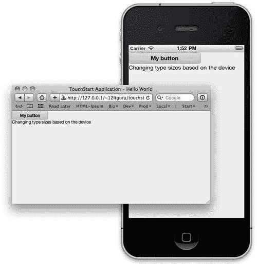

这些类型的条件样式调整将有助于保持应用在多个设备上的可读性和可用性。

# 使用 Sencha.io Src 在多台设备上显示图像

如果应用使用图像，则可能需要比条件样式（如前一节中使用的样式）更健壮的样式。为每个设备创建单独的图像集将是一场噩梦。幸运的是，Sencha 的员工对这个问题有了一个答案：一个名为 `Sencha.io Src`的基于 web 的服务。

`Sencha.io Src`是 Sencha Touch 的独立服务，可用于任何基于 web 的应用。该服务的工作原理是拍摄原始图像并动态调整其大小，以适应当前设备和屏幕大小。这些图像也由服务缓存，并针对快速、可重复的交付进行了优化。要使用 `Sencha.io Src`服务，您只需更改图像的 URL。

例如，基本 HTML 图像标记如下所示：

```js


```

使用 `Sencha.io Src`服务的同一图像标签如下所示：

```js


```

这会将图像的实际 URL 传递给系统进行处理。

### 提示

**Sencha.io Src**中的图像 URL

正如您在示例中看到的，我们使用的是完整的图像 URL（带[）http://www.mydomain.com/)](http://www.mydomain.com/))，而不是较短的相对 URL（如img/my-big-image.jpg)`。因为 `Sencha.io Src`服务需要能够从主 `Sencha.io`直接访问文件服务器，相对 URL 将不起作用。图像文件需要位于公共可用的 web 服务器上才能正常工作。

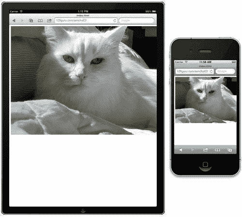

通过使用该服务，我们的大图像将被缩放以适应设备屏幕的全宽，无论我们使用的设备大小如何。 `Sencha.io Src`还保持图像比例正确，没有任何挤压或拉伸。

## 使用 Sencha.io Src 指定尺寸

我们在应用中并不总是使用全屏图像。我们经常在应用中使用它们来显示图标和重音符号。 `Sencha.io Src`还允许我们为图像指定特定的高度和/或宽度：

```js


```

在本例中，我们将图像的宽度设置为 `320`像素，高度设置为 `200`像素。我们还可以仅约束宽度，高度将自动设置为正确的比例：

```js


```

### 提示

需要注意的是， `Sencha.io Src`只会缩小图像。它不会扩大它们。如果输入的值大于实际图像的尺寸，它将以完整图像尺寸显示。

全尺寸图像应始终是显示所需的最大尺寸。

### 按配方上浆

我们还可以使用公式根据设备的屏幕大小进行更改。例如，我们可以使用以下代码使照片比屏幕的全宽窄 20 像素：

```js


```

如果要在图像周围留下一个小边框，这将非常有用。

### 按百分比上浆

我们还可以使用百分比宽度设置图像大小：

```js


```

URL 的 `x50`部分将图像大小设置为屏幕宽度的 50%。

我们甚至可以结合这两个元素创建一个可伸缩的图像库：

```js


```

通过使用公式 `-20x50-5`，我们获取原始图像，删除 20 个像素作为边距，将其缩小到 50%，然后再删除另外 5 个像素，以留出两幅图像之间的空间。

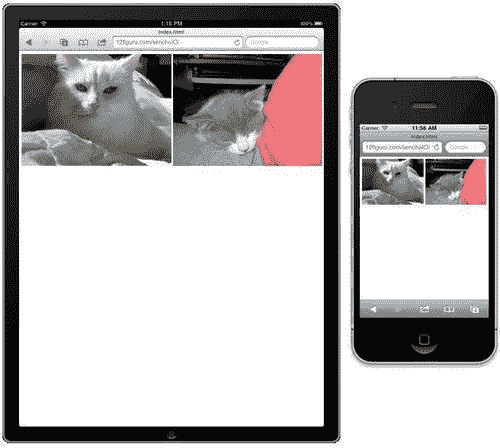

### 更改文件类型

`Sencha.io Src`提供了一些您可能会觉得有用的附加选项。第一个选项允许您动态更改图像的文件类型。例如，以下代码将以 PNG 格式返回您的 JPG 文件：

```js


```

当为应用的用户提供多个图像下载选项时，这可能非常有用。

此选项还可以与调整大小选项结合使用：

```js


```

这会将文件转换为 PNG 格式，并将其缩放到 50%。

通过使用 `Sencha.io Src`中提供的功能，您可以为应用自动调整图像大小，并在多台设备上提供一致的外观和感觉。

有关可与 `Sencha.io Src`一起使用的所有功能的完整列表，请转至[http://www.sencha.com/learn/how-to-use-src-sencha-io/](http://www.sencha.com/learn/how-to-use-src-sencha-io/) 。

# 总结

在本章中，我们介绍了如何使用 `ui`配置选项设置工具栏的样式。我们还讨论了 Sencha Touch 如何使用 SASS 和 Compass 创建强大的主题系统。我们包括了 SASS 和 Compass 的安装说明，并提供了 mixin、变量、嵌套和选择器继承的解释。最后，我们讨论了使用 `Sencha.io Src`为多个设备设计接口和处理自动图像大小调整。

在下一章中，我们将回到 Sencha Touch 框架。我们将回顾一下我们之前了解的关于组件层次结构的一些内容。然后，我们将介绍一些可用的更专业的组件。最后，我们将为您提供一些在 Sencha Touch API 文档中查找所需信息的技巧。