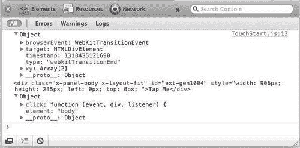
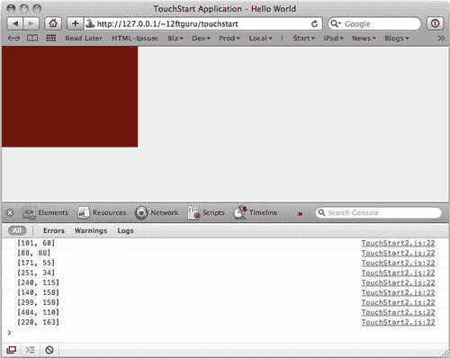
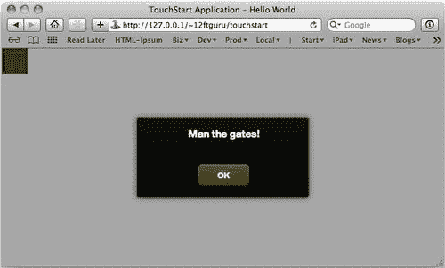
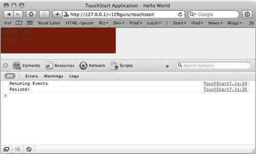
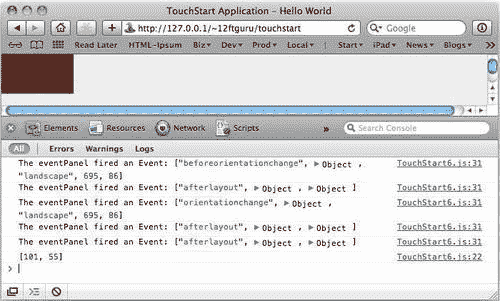
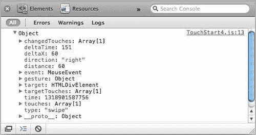
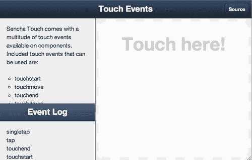

# 第五章事件

在上一章中，我们详细介绍了 Sencha Touch 中可用的组件。然而，仅仅创建组件并不足以构建应用程序。这些组件仍然需要相互通信，以使我们的应用程序能够做任何真正有用的事情。这就是事件发挥作用的地方。

在本章中，我们将研究 Sencha Touch 中的事件：它们是什么，我们为什么需要它们，以及它们是如何工作的。我们将讨论如何使用侦听器和处理程序使应用程序对用户的触摸以及幕后发生的事件作出反应。我们还将介绍一些有用的概念，如可观察捕获和事件委派。最后，我们将对触摸特定事件进行演练，并了解如何从 Sencha touch API 获取更多信息。

本章将涵盖以下几点：

*   事件
*   侦听器和处理程序
*   Ext.util.Observable
*   活动代表团
*   触摸特定事件
*   关于活动的补充资料

# 什么是事件？

作为程序员，我们倾向于将代码视为有序的指令序列，执行一行，然后执行下一行，再执行下一行。我们很容易忽略这样一个事实，即我们的代码确实花了很多时间坐着等待用户做一些事情。它正在等待用户按下按钮、打开窗口或从列表中选择。代码正在等待事件。

通常，事件发生在组件执行特定任务之前或之后。当任务执行时，事件将广播到系统的其余部分，在那里它可以触发特定代码或被其他组件用于触发新操作。

例如，每当点击 Sencha Touch 中的按钮时，它将触发事件。这个点击可以在按钮内执行代码，创建一个新的对话框，或者面板组件可以“监听”按钮正在做什么，并在“听到”按钮触发 `tap`事件时改变其颜色。

考虑到大多数应用程序都是用于人机交互的，可以肯定地说，程序的许多功能都来自于对事件的响应。从用户的角度来看，这些事件使程序实际上“做”了一些事情。程序正在响应用户的请求。

除了响应请求之外，事件在确保事情按正确顺序发生方面也起着重要作用。

## 异步与同步

阿尔伯特·爱因斯坦曾经说过：“时间的唯一原因是一切不会同时发生。”。虽然这看起来像是一个即兴的评论，但在编写代码时，它实际上有很大的相关性。

当我们在 Sencha Touch 中编写代码时，我们正在引导 web 浏览器在用户屏幕上创建和销毁组件。这个过程的明显限制是，我们不能在组件创建之前或销毁之后对其进行操作。

乍一看，这似乎很简单。在实际创建组件之前，您永远不会编写一行试图与*行上的组件对话的代码，那么问题出在哪里？*

问题与代码中的异步操作有关。虽然我们的大多数代码将按顺序或以同步方式执行，但在许多情况下，我们需要发送请求并返回响应，然后才能继续。在基于 web 的应用程序中尤其如此。

例如，假设我们有一行代码，使用来自 GoogleMaps 的请求构建地图。我们需要等到收到谷歌的回复并呈现地图后才能开始摆弄它。但是，我们不希望在等待响应时应用程序的其余部分冻结。因此，我们发出一个异步请求，一个在后台发生的请求，而应用程序的其余部分继续其业务。

这些异步请求称为 AJAX 请求。**AJAX**代表**异步 JavaScript 和 XML**。如果我们将其中一个按钮配置为发送 AJAX 请求，那么当应用程序等待响应时，用户仍然可以执行其他操作。

在界面方面，您可能希望让用户知道我们发出了请求，目前正在等待响应。在大多数情况下，这意味着显示“正在加载”消息或动画图形。

使用 SenchaTouch 中的事件，我们可以通过在 AJAX 组件中绑定 `beforerequest`事件来显示加载图形。因为我们需要知道何时使加载消息消失，所以我们的组件将等待来自 AJAX 请求的 `requestcomplete`事件。一旦该事件触发，我们就可以执行一些代码来告诉加载消息消失。我们还可以使用 `requestexception`事件通知用户在请求过程中是否发生了错误。

使用这种类型的事件驱动设计，您可以快速响应用户的操作，而无需让他们等待代码需要执行的一些更耗时的请求。您还可以使用事件通知用户错误。事件的关键是让您的其他组件“侦听”事件，然后告诉他们如何处理接收到的信息。

# 听者和处理者

Sencha Touch 中的每个组件都有一长串它生成的事件。考虑到应用程序中可能包含的组件数量，会有很多闲聊。

想象一个有 100 人的聚会，所有人都有很多不同的对话。现在想象一下，试着从每次对话中挑选出所有有用的信息。这是不可能的。为了收集有用的信息，你必须专注于一个特定的对话。

同样的，组件也必须被告知要听什么，否则，比如我们不幸的聚会者，他们很快就会不知所措。对我们来说幸运的是，有一种说法。

`listeners`配置告诉组件需要注意哪些事件。可以像 Sencha Touch 中的任何其他配置选项一样添加侦听器。例如，面板上的配置选项可能如下所示：

```js
listeners: {
tap: {
element: 'body',
fn: function(){ Ext.Msg.alert('Single Tap'); }
}
}

```

当用户点击面板的 `body`元素时，此配置选项告知面板监听 `tap`事件。当 `tap`事件发生时，我们执行 `fn`配置选项中列出的函数（通常称为处理程序）。在这种情况下，我们会弹出一个消息框，上面写着**单键点击**。

请注意，我们的 `listeners`配置中的项目始终是对象的一部分（两边都是花括号），即使我们只监听一个事件。如果我们要添加第二个事件，它将如下所示：

```js
listeners: {
tap: {
element: 'body',
fn: function(){ Ext.Msg.alert('Single Tap'); }
},
hide: {
fn: function(){ this.destroy(); }
}
}

```

我们还可以从侦听器获取信息，并在处理程序函数中使用它。例如， `tap`事件发回 `event`对象、单击的 DOM 元素和 `listener`对象本身，如果我们在面板上有以下侦听器：

```js
listeners: {
tap: {
element: 'body',
fn: function(event, div, listener) {
console.log(event, div, listener);
}
}
}

```

当用户点击面板内部时，我们将在控制台上获得以下信息：



### 提示

**事件的参数**

您会注意到，默认情况下，某些值会传递给我们的事件。这些默认值可在每个组件的 Sencha Touch API 事件文档中的[中找到 http://docs.sencha.com/touch/1-1/](http://docs.sencha.com/touch/1-1/) 。

每个事件都有自己的默认值。从 Sencha API 文档中选择一个组件，然后单击页面顶部的**事件**，查看该组件的所有事件列表。每个事件的描述将包括其默认参数。

从控制台可以看到，我们的 `event`对象包含点击发生时间的 Unix 时间戳、点击本身的 `x`和 `y`坐标，以及被点击的 `div`标记的全部内容。您可能还注意到我们的 `tap`事件在调试输出中被称为 `click`事件。在 Sencha Touch 中， `tap`和 `click`事件彼此别名。这保留了桌面浏览器的传统 `click`事件和移动浏览器的 `tap`事件之间的兼容性。

我们可以在函数中使用所有这些信息。

对于本例，我们将创建一个带有红色容器的简单面板。我们的点击侦听器将更改红色框的大小，以匹配我们在屏幕上点击的位置：

```js
new Ext.Application({
name: 'TouchStart',
launch: function() {
var eventPanel = new Ext.Panel({
fullscreen: true,
layout: 'auto',
items: [{
xtype: 'container',
width: 40,
height: 40,
id: 'tapTarget',
style: 'background-color: #800000;',
}],
id: 'eventPanel',
listeners: {
tap: {
element: 'body',
fn: function(event, div, listener) {
var cmp = Ext.getCmp('tapTarget');
cmp.setWidth(event.xy[0]);
cmp.setHeight(event.xy[1]);
console.log(event.xy);
}
}
listenersabout}
});
this.viewport = eventPanel;
}
});

```

如果我们在控制台打开的情况下运行此代码，我们可以看到点击位置的 X 和 Y 坐标出现在控制台中。我们的长方体也会增大或缩小以匹配这些值。



正如您从代码中看到的，我们监听 `tap`事件。然后我们使用 `Ext.getCmp('tapTarget')`获取 `container`组件；，根据我们从 `tap`事件中得到的值更改大小

```js
tap: {
element: 'body',
fn: function(event, div, listener) {
var cmp = Ext.getCmp('tapTarget');
cmp.setWidth(event.xy[0]);
cmp.setHeight(event.xy[1]);
console.log(event.xy);
}
}

```

由于 `event.xy`是一个数组，我们需要使用 `event.xy[0]`和 `event.xy[1]`获取单个值。

## 动态添加侦听器和事件

监听器也可以动态添加到组件中。如果我们在前面的示例中添加一个新的侦听器，它将如下所示：

```js
var cmp = Ext.getCmp('tapTarget');
cmp.on('resize',
function() {
var h = this.getHeight();
var w = this.getWidth();
this.update('height: '+h+'<br>width: '+w)
}, cmp);

```

此代码将获取容器的高度和宽度。当触发 `resize`事件时，它将使用 `update`方法将高度和宽度作为文本添加到容器中。

但是，这种方法有一个小问题： `resize`事件仅在通过拖动可手动调整大小的容器的左下角手动调整容器大小时触发。由于我们的事件是以编程方式更改的， `resize`事件永远不会被触发。

我们可以通过使用 `fireEvent()`方法手动触发前面代码中的事件来修复此问题

```js
listeners: {
tap: {
element: 'body',
fn: function(event, div, listener) {
var cmp = Ext.getCmp('tapTarget');
cmp.setWidth(event.xy[0]);
cmp.setHeight(event.xy[1]);
console.log(event.xy);
cmp.fireEvent('resize');
}
}
}

```

`fireEvent()`方法既可以用于现有事件，也可以用于您自己的自定义事件。

## 定制活动

虽然 Sencha Touch 组件响应大量事件，但有时在应用程序中触发自定义事件会有所帮助。

例如，您可以使用与前面示例相同的语法类型触发一个名为 `vikinginvasion`的自定义事件：

```js
cmp.fireEvent('vikinginvasion');

```

然后，您可以在代码中为 `vikinginvasion`添加一个侦听器，以及一个处理事件的函数：

```js
var cmp = Ext.getCmp('tapTarget');
cmp.on('vikinginvasion',
function() {
alert("Man The gates!");
}, this);

```



您还可以使用 `hasListener()`方法：检查组件是否有特定的侦听器

```js
var cmp = Ext.getCmp('tapTarget');
if(cmp.hasListener('vikinginvasion') {
console.log('Component is alert for invasion');
} else {
console.log('Component is asleep at its post');
}

```

您还可以使用许多有用的选项来控制侦听器检查事件的方式。

## 监听器选项

在大多数情况下，监听器可以简单地配置事件名称、处理程序和范围，但有时需要更多的控制。Sencha Touch 提供了许多有用的选项来修改侦听器的工作方式：

*   `delay:`这将延迟事件触发后处理程序的操作。它以毫秒为单位。
*   `single:`这提供了一个一次性处理程序，在下一个事件触发后执行，然后删除自身。
*   `buffer:`这导致处理程序被安排作为 `Ext.util.DelayedTask`组件的一部分运行。这意味着，如果触发事件，我们将等待一定的时间，然后再执行处理程序。如果同一事件在延迟时间内再次触发，我们将在执行处理程序之前重置计时器（仅一次）。
*   `element:`这允许我们指定组件内的特定元素。例如，我们可以为 `tap`事件指定面板中的主体。这将忽略对停靠项目的点击，而只侦听面板主体上的点击。
*   `target:`这会将侦听器限制为来自目标的事件，并忽略来自其任何子级的相同事件。

使用不同的侦听器选项将类似于以下内容：

```js
var cmp = Ext.getCmp('tapTarget');
cmp.on('vikinginvasion', this.handleInvasion, this, {
single: true,
delay: 100
});

```

本例将为 `vikinginvasion`添加一个侦听器，并执行一个名为 `this.handleInvasion`的函数。处理程序在 100 毫秒延迟后只执行一次。然后，它将从组件中移除自身。

此基本配置选项列表在添加侦听器时为您提供了相当大的灵活性。然而，监听器中还有一个额外的配置选项需要更多的解释。它叫 `scope.`

## 范围

在处理函数中有一个名为 `this`的特殊变量。通常， `this`指触发事件的组件，在这种情况下， `scope`通常会设置为 `scope: this`。但是，可以在侦听器配置中为 `scope`指定不同的值。根据前面的示例， `scope`中的更改可能如下所示：

```js
tap: {
element: 'body',
scope: eventPanel,
fn: function(event, div, listener) {
this.setWidth(event.xy[0]);
this.setHeight(event.xy[1]);
console.log(event.xy);
}
}

```

在本例中， `scope`（因此，变量 `this)`已更改为我们的 `eventPanel`组件。我们现在可以直接设置值，而不必使用 `Ext.getCmp('tapTarget')`；在函数开始时获取面板。

我们也可以用类似的方式设置 `scope`组件，使用 `on`方法添加一个监听器：

```js
var myPanel = new Ext.Panel({...});
var button = new Ext.Button({...});
button.on('click', function() {
console.log('This should be myPanel:', this);
}, myPanel);

```

在这里，我们在处理程序定义之后添加了 `myPanel`作为参数，这意味着当触发 `click`事件并调用处理程序函数时，您可以通过引用 `this`来访问 `myPanel`。

在处理函数中，定义函数时不能保证访问相同的变量。更改函数的范围可以让您访问特定的变量，而使用 `Ext.getCmp()`或 `Ext.get()`很难访问该变量。它也可以是一种简单方便的方式，用于访问最有可能在函数中使用的组件。

虽然 `scope`可能很难理解，但它是侦听器配置中非常有用的一部分。

## 删除侦听器

通常，当组件被销毁时，侦听器会自动删除。但是，有时您会希望在销毁组件之前删除侦听器。要做到这一点，您需要对创建侦听器时使用的处理函数进行引用。

到目前为止，我们一直在使用匿名函数来创建侦听器，但是如果我们要删除侦听器，我们必须以不同的方式执行：

```js
var myPanel = new Ext.Panel({...});
var myHandler = function() {
console.log('myHandler called.');
};
myPanel.on('click', myHandler);

```

这是一个很好的实践，因为它允许您定义一次处理程序函数，并在需要时重用它们。它还允许您稍后删除处理程序：

```js
myPanel.removeListener('click', myHandler);

```

### 提示

用 Sencha 的说法， `on()`是 `addListener()`的别名， `un()`是 `removeListener()`的别名，这意味着它们做的事情完全相同。在处理事件时，可以随意使用任何您喜欢的选项。

## 管理的侦听器

在某些情况下，侦听器是两个对象之间关系的一部分，当其中一个对象被销毁时，侦听器不再是必需的。

例如，假设您有两个面板， `panel1`和 `panel2`，并且您希望在调整 `panel2`的大小时更改 `panel1`的大小以匹配 `panel2`的大小。你可以在 `panel2`的 `resize`事件中设置一个侦听器，但是如果 `panel1`被销毁，侦听器仍然会在那里。

您可以向 `panel1`添加一个额外的监听器，等待 `destroy`事件，然后将监听器从 `panel2`中删除，但这可能会很快变得麻烦。

您可以通过使用托管侦听器来解决这个特定问题。托管侦听器的工作方式与常规侦听器略有不同：

```js
var panel1 = new Ext.Panel({...});
var panel2 = new Ext.Panel({...});
panel1.addManagedListener(panel2, 'resize',
function() {
console.log('Panel 2 was resized.');
panel1.setSize(panel2.getSize());
}
);

```

这可能会让人有点困惑，因为当我们调用 `panel1.on()`或 `panel1.addListener()`时，我们正在向 `panel1`添加一个侦听器。然而，当我们调用 `addManagedListener()`时，第一个参数实际上是我们添加侦听器的另一个组件。在本例中，我们将向 `panel2`添加一个 `resize`侦听器，如果 `panel1`被销毁，该侦听器将自动删除。

本质上， `addManagedListener`添加了自己清理的侦听器，这对内存管理有很大帮助。

## 手柄和按钮

正如您可能已经从我们前面的一些代码中注意到的，按钮有一个名为 `handler`的默认配置。这是因为按钮的用途通常是单击或点击。 `handler`配置只是添加 `tap`侦听器的一种有用的简写方式。因此，以下两段代码的作用完全相同：

```js
var button = new Ext.button({
text: 'press me',
handler: function() {
this.setText('Pressed');
}
})
var button = new Ext.button({
text: 'press me',
listener: {
tap: {
fn: function() {
this.setText('Pressed');
}
}
}
});

```

同样的默认处理程序行为也适用于选项卡。处理程序只是作为访问组件最常用事件的快速方法。

## 暂停和排队事件

有时，您会希望阻止组件触发事件。也许您想要对从 AJAX 查询返回的数据进行一些额外的处理，或者您想要编写一些自定义代码来处理组件的大小调整。 `Observable`提供了一种通过 `suspendEvents()`和 `resumeEvents()`方法实现的方法。您可以对扩展了 `Observable`的任何对象调用这些方法，例如面板：

```js
var myPanel = new Ext.Panel({...});
myPanel.suspendEvents();
myPanel.setHeight(100);
myPanel.setWidth(100);
myPanel.resumeEvents();

```

正常情况下， `setHeight()`和 `setWidth()`功能会触发 `resize`事件。不过，在本例中，我们基本上是在调整面板大小时将其休眠，然后在调整完毕后将其唤醒。在这种情况下， `resize`事件将永远不会触发，因此任何侦听该事件的组件将永远不会听到它。

请注意，我们只挂起了 `myPanel`对象上的事件。如果我们同时调整了另一个面板的大小，那么该面板的事件仍然会触发。

当您需要在应用程序的后台执行操作时，这非常有用，但有时您希望在完成工作后触发事件，以便其他组件能够跟上。在这种情况下，只需将 `true`作为参数传递给 `suspendEvents():`

```js
myPanel.on('resize', function() {
console.log('Resized!');
});
myPanel.suspendEvents(true);
myPanel.setHeight(100);
myPanel.setHeight(100);
console.log('Resuming Events.');
myPanel.resumeEvents();

```



您可以看到**恢复事件**行如何在 `resize`事件之前出现。这是因为我们在 `console.log()`和 `resumeEvents()`呼叫之后才触发任何事件。

您应该非常小心地暂停事件。许多内置 Sencha Touch 功能严重依赖于事件，挂起它们可能会导致意外行为。

## 常见事件

让我们看一下我们的老朋友，看看我们可以看到的一些常见事件。请记住，由于我们的大多数组件将继承自 `Ext.Component`，因此这些事件在我们使用的大多数组件中都是常见的。

我们的大多数活动将分为两类。第一组事件围绕组件的创建展开。

当 web 浏览器执行 Sencha Touch 代码时，它会将组件作为一系列的 `div, span`和其他标准 HTML 标记写入网页。这些元素还链接到 Sencha Touch 中的代码，该代码标准化了所有受支持的 web 浏览器的组件外观和功能。此过程称为渲染组件。

此渲染分多个阶段进行，每个阶段触发一个事件：

*   `beforerender:`在渲染过程开始之前
*   `added:`组件加入容器时
*   `beforeactivate:`组件被视觉激活前
*   `activate:`当部件被视觉激活时
*   `render:`组件的 HTML 呈现后
*   `afterrender:`渲染完成后

这些事件为您提供了在渲染过程之前、期间和之后与组件交互的许多位置。

第二组事件与组件本身采取的或对组件本身执行的操作有关。这些活动包括：

*   在组件上使用 `show`方法时`show:`激发
*   在组件上使用 `hide`方法时`hide:`激发
*   `destroy:`组件损坏时触发
*   在组件上使用 `disable`方法时`disable:`激发
*   在组件上使用 `enable`方法时`enable:`激发
*   `orientationchange:`当设备方向改变时触发
*   `remove:`当组件从容器中取出时触发
*   `resize:`组件大小调整后触发

这些事件提供了一种基于组件正在执行或对组件执行的操作来执行代码操作的方法。

每个组件还将有一些与之关联的特定事件。有关这些事件的列表，请参考[上的 API 文件 http://docs.sencha.com/touch/1-1/](http://docs.sencha.com/touch/1-1/) 。只需从左侧列表中选择一个组件，然后单击页面顶部的**事件**按钮。

## 可观察的外部工具

`Ext.util.Observable`是处理所有 Sencha Touch 组件的事件监听和触发的基类。触发事件的任何类都扩展了 `Ext.util.Observable`。在大多数情况下，您不需要直接使用 `Ext.util.Observable`本身，因为它几乎内置于每个 Sencha Touch 组件中，但在一些情况下，直接使用它可以使事情变得更简单。

## 通过观察集中事件处理

有时，在构建应用程序的过程中，您会发现自己多次向同一类对象添加相同的侦听器。对于大型应用程序，这可能会占用大量内存。这就是 `Ext.util.Observable.observe()`的用武之地。此方法将允许您将侦听器添加到类中，而不是该类的特定实例。通常，当我们添加侦听器时，我们会执行如下操作：

```js
var panel = new Ext.Panel({...});
panel.on('resize', function(){...});

```

仅当调整面板的大小时，侦听器才会运行。要向所有 `Ext.Panel`组件添加侦听器，您可以传递要观察的组件构造函数，然后添加侦听器：

```js
Ext.util.Observable.observe(Ext.Panel);
Ext.Panel.on('resize', function(){...});

```

您会注意到，我们没有在此处创建新面板。相反，我们将 `resize`侦听器添加到 `Ext.Panel`本身。现在，使用新的 `Ext.Panel()`组件创建的任何面板都将自动启用 `resize`侦听器。

此外，当您需要更改 `resize`侦听器和函数时，这为您提供了一个单独的更新位置。这种类型的基于类的侦听器可以节省时间、内存和很多麻烦。

## 捕获：调试工具

`Ext.util.Observable.capture`是一种静态方法。这意味着您不必创建对象的新实例，您可以直接调用它。此方法将为对象触发的每个事件调用一个处理程序，当您试图确定是否已将侦听器添加到适当的事件以及这些事件是否正在触发时，此方法将派上用场。

使用我们的调整大小 `eventPanel`示例，在 `this.viewport = eventPanel;:`之后添加以下行

```js
Ext.util.Observable.capture(eventPanel, function() {
console.log('The eventPanel fired an Event:', arguments);
});

```



如您所见，这会生成许多控制台行。函数的第一个参数始终是事件名称，随后的参数将是通常传递给该特定事件的参数。如果只想在某个已知事件触发后才开始捕获事件，可以将 `capture`语句添加到侦听器中。例如，如果只希望在呈现面板后开始捕获事件，则可以执行以下操作：

```js
listeners: {
render: {
fn: function(myPanel) {
Ext.util.Observable.capture(eventPanel,
function() {
console.log('The eventPanel fired an Event:', arguments);
});
}
}
}

```

现在， `Ext.util.Observable.capture`只会在 `render`事件触发后启动。从那时起，它将继续捕获面板触发的所有事件。

您也可以使用 `Ext.util.Observable.releaseCapture()`停止捕捉。假设我们想在 `resize`事件之后停止捕获事件。然后，在我们的 `capture`函数中，我们可以执行以下操作：

```js
Ext.util.Observable.capture(eventPanel, function() {
console.log('The eventPanel fired an Event:', arguments);
if (arguments[0] == 'resize') {
Ext.util.Observable.releaseCapture(eventPanel);
}
});

```

### 提示

即使有了 `releaseCapture()`handy，您也要确保在产品化部署之前从代码中删除任何 `capture`语句，因为它们可能非常占用内存和处理器。

# 活动委托

当 Sencha Touch 中的某个组件触发事件时，该事件会“冒泡”到父组件的链。这给了我们一些关于记忆和效率的有趣机会。

## 事件与记忆

事件委派的一个常见用途是在列表中。比如说，我们有一个类似于普通通讯簿中的人的列表。单击通讯簿中的姓名时，我们将切换到包含所有联系信息的详细信息面板。这是一个非常简单的设置，我们大多数人都会认识到。

但是，假设我们想在每个列表项中添加一个手机图标。单击电话图标时，会拨打此人的电话号码。您可能倾向于为每个图标添加一个 `click`处理程序，但这是一个非常糟糕的主意，因为所有这些侦听器都会占用内存空间。

一本有 400 人的通讯录将有 400 名听众。这将减慢基于 web 的应用程序的速度，因为它尝试侦听 DOM 中的 400 个独立元素（以及代码中具有侦听器的所有其他元素）。

但是，您可以使用事件委派来解决这个问题。

## 授权活动

让我们从一个非常简化的联系人列表开始：

```js
var contactList = new Ext.List({
tpl: '<tpl for="."><li><h1>{contactName}</h1></li></tpl>',
listeners: {
el: {
tap: callContact,
delegate: 'img'
}
}
});

```

与前面的示例不同，我们指示组件侦听哪个事件，在本例中，我们告诉组件在哪里侦听事件。在本例中，我们选择了 `el`，这是所有组件的公共属性，基本上是指项目内的属性（我们也可以使用 body）。

既然组件知道在哪里听，我们就在线路 `tap: callContact`上告诉它要听什么。这还告诉 `List`组件在 `tap`事件发生时运行什么。

最后一行， `delegate: 'img'`将事件委托给 `List`组件中的任何 `img`标记。在这种情况下，它将是列表中每一行的 `phone.png`图标。

结果是一个侦听器，它检查列表中是否有图像被点击。

这节省了内存，也意味着如果添加或删除任何列表项，也不必添加或删除侦听器。

# 触摸特定事件

除了组件事件外，Sencha Touch 还了解许多触摸特定事件。这些事件包括：

*   `touchstart:`记录设备初始接触点的事件。
*   `touchend:`记录设备上触点结束位置的事件。
*   `touchmove:`记录触摸移动位置的事件（此事件将作为一系列事件触发，映射用户触摸沿屏幕的路径）。
*   `touchdown:`记录拖动或滑动时触摸元素的事件。
*   `dragstart:`记录元素最初拖动时间的事件。
*   `drag:`类似于 `touchmove, drag`在拖动时跟踪元素的路径。
*   `dragend:`记录元素停止拖动位置的事件。
*   `singletap:`在屏幕上点击一次。当屏幕被双击时，第一次点击将触发一次。它不会在第二个水龙头上点火。
*   `tap:`轻敲屏幕。当屏幕被双击时，第一次和第二次点击都会触发。
*   `doubletap:`在屏幕上快速点击两下。
*   `taphold:`点击并按住屏幕。
*   `tapcancel:`当您停止按住水龙头时触发的事件。
*   `swipe:`一根手指从左到右扫过屏幕。
*   `pinch:`两个手指捏在一起。
*   `pinchstart:`开始挤压的地方。
*   `pinchend:`夹点结束的地方。

对于这些特定于触摸屏的事件，有一点需要注意：除了 `tap`和 `doubletap`之外，Sencha touch 实际上是从 web 浏览器而不是组件本身接收事件。由于 web 浏览器正在为我们监听，我们需要将侦听器附加到 web 浏览器能够理解的内容上。

这意味着我们必须将事件绑定到组件的底层元素，而不是将事件绑定到组件本身。

### 提示

**部件对元件**

对于刚接触网络编程的人来说，其中一个较难理解的概念是网络浏览器和 Sencha Touch 组件之间的关系。其核心是，当 Sencha Touch 组件在 web 浏览器中呈现时，它会被转换为一系列复杂的 `div`和 `span`，web 浏览器可以读取和显示。当我们提到组件的底层元素时，我们谈论的是这些 `div`容器之一。

由于基于 WebKit 的浏览器（如 Safari 或 Chrome）旨在了解我们所有的触摸特定事件，因此可以指示 Sencha touch 组件监控网页上的 `div`标记，以查看这些事件是否发生。

此外，由于组件只能监视一个 `div`标记，因此它只能在将 `div`标记呈现到 web 页面后进行监视。这意味着我们必须将组件设置为侦听 `render`事件，然后告诉它添加监视。它看起来如下所示：

```js
new Ext.Application({
name: 'TouchStart',
launch: function() {
var eventPanel = new Ext.Panel({
fullscreen: true,
layout: 'fit',
html: 'Tap Me',
id: 'eventPanel',
listeners: {
afterRender: function() {
this.mon(this.el, {
swipe: this.event2Console
});
}
},
event2Console: function(e) {
console.log(e);
}
});
this.viewport = eventPanel;
}
});

```

我们像往常一样创建面板，并为 `afterRender`添加一个侦听器。这告诉面板，一旦它存在于浏览器窗口中，它就应该执行以下代码（在本例中，我们希望它运行）：

```js
this.mon(this.el, {
swipe: this.event2Console
});

```

这将导致 Sencha Touch 侦听由面板的 DOM 元素而不是面板本身生成的浏览器事件。元素然后侦听 `swipe`事件的发生。当 `swipe`事件发生时，我们执行我们的函数 `this.event2Console`。

注意，这次我们做的事情有点不同。通常，我们将函数创建为侦听器的一部分：

```js
this.mon(this.el, {
swipe: function(e) {
console.log(e);
}
}

```

相反，我们将函数添加到组件本身，就像配置对象一样：

```js
event2Console: function(e) {
console.log(e);
}

```

然后，我们将该函数引用为 `this.event2Console`。当您想从组件中的多个位置调用函数时，这会非常有用。这两种方法都将产生相同的结果：一个带有事件对象的控制台日志。



如您所见，我们从这次事件中获得了大量信息，包括**方向、距离、deltaX、时间**和事件**类型**。我们可以使用以下信息：

```js
this.update(e.type+':'+e.direction+':'+e.distance);

```

这个方法可以添加到我们的 `this.event2Console`功能中，用我们的刷卡类型、方向和距离更新我们的面板。试试看。

另外，将代码中的 `swipe`事件更改为列表中的任何其他函数。了解是什么触发了每个事件以及它们返回的信息。

通过使用这些触摸事件和 Sencha touch 内置的其他事件，您的程序应该能够响应几乎任何情况。

# 关于事件的附加信息

获取事件信息的最佳地点是[上的 Sencha Touch API 文档 http://docs.sencha.com/touch/1-1/](http://docs.sencha.com/touch/1-1/) 。在左侧列表中选择一个组件，并查找顶部的**事件**按钮。您可以单击**事件**转到该部分的开头，或将鼠标指针悬停以查看事件的完整列表，并从该列表中选择特定事件。

单击事件旁边的向下箭头将显示事件的参数列表以及有关如何使用事件的任何可用示例。

了解触摸特定事件的另一个好地方是厨房水槽示例应用程序（[http://dev.sencha.com/deploy/touch/examples/kitchensink/](http://dev.sencha.com/deploy/touch/examples/kitchensink/) ）。应用程序内部有一个**触摸事件**部分。本节允许您点击或单击屏幕，查看不同点击和手势生成的事件。



SenchaTouch 的 WebKit 团队还为 Android 创建了一个事件记录器。您可以在[获取更多信息 http://www.sencha.com/blog/event-recorder-for-android-web-applications/](http://www.sencha.com/blog/event-recorder-for-android-web-applications/) 。

# 总结

在本章中，我们介绍了事件的基本概述，以及如何使用侦听器和处理程序使程序响应这些事件。我们还介绍了一些更常见的事件，并深入了解了 `Ext.util.Observable`，它处理 Sencha Touch 框架中每个组件的事件。

我们讨论了事件委托和侦听器可能出现的潜在内存问题。我们在本章结束时介绍了触摸特定的事件，并提供了一些关于查找事件附加信息的提示。

在下一章中，我们将介绍如何使用 JSON、数据存储、模型和表单在 SenchaTouch 中获取和存储数据。