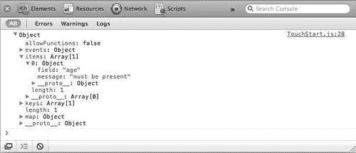
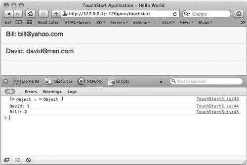
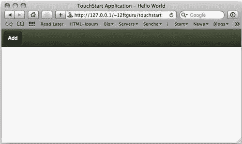
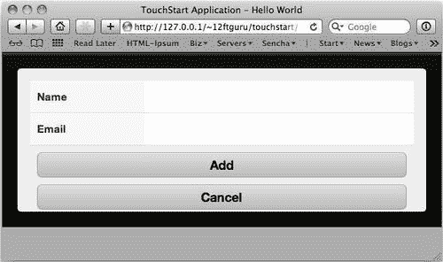
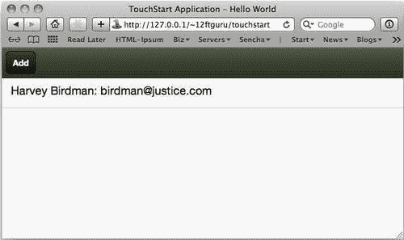
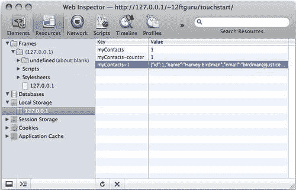
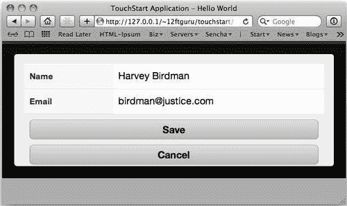
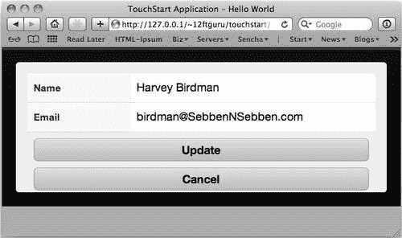

# 第六章，获取数据

任何应用程序的一个关键方面都是处理数据，将数据放入应用程序中，以便您可以对其进行操作和存储，然后再次将其取出以供显示。我们将在接下来的两章中介绍 Sencha Touch 中的数据处理。关于数据的第一章将重点介绍如何将数据导入应用程序。

我们将首先讨论用于描述数据的数据模型。然后，我们将讨论收集数据的读取器以及用于保存数据以在应用程序中使用的存储。一旦我们掌握了数据的去向，我们将介绍如何使用表单将数据传递到那里。我们将研究如何验证您的数据，并为您提供一些表单提交的示例。最后，我们将研究如何将数据返回到表单中进行编辑。这将作为我们下一章关于数据的出发点，这一章将涵盖获取数据以供显示。

本章涵盖以下主题：

*   数据模型
*   数据格式
*   数据存储
*   使用表单和数据存储

# 型号

在 Sencha Touch 应用程序中处理数据的第一步是创建数据模型。如果您习惯于数据库驱动的应用程序，那么将模型视为数据库模式是很有帮助的：它是一种定义我们要存储的数据的结构，包括数据类型、验证和结构。这为应用程序的其余部分提供了一个通用映射，用于理解来回传递的数据。

## 基本模型

最基本的是，该模型使用 `Ext.regModel()`来描述数据字段，例如：

```js
Ext.regModel('User', {
fields: [
{name: 'firstname', type: 'string'},
{name: 'lastname', type: 'string'},
{name: 'username', type: 'string'},
{name: 'age', type: 'int'},
{name: 'email', type: 'string'},
{name: 'active', type: 'boolean', defaultValue: true},
]
}

```

第一行声明我们已将新车型命名为 `User`。然后，我们将数据字段描述为具有名称、类型和可选默认值的字段数组。名称只是我们希望在代码中引用数据的方式。有效数据类型为：

*   `auto:`只接受原始数据而不进行转换的默认值
*   `string:`将数据转换成字符串
*   `int:`将数据转换成整数
*   `float:`将数据转换成浮点整数
*   `boolean:`将数据转换为真或假布尔值
*   `date:`将数据转换成 JavaScript `Date`对象

如果没有收到该字段的数据，则可以使用默认值设置要使用的标准值。在我们的示例中，我们将 `active`的值设置为 `true`。我们可以在使用 `Ext.ModelMgr.create():`创建新用户实例时使用此选项

```js
var newUser = Ext.ModelMgr.create({
firstname: 'Nigel',
lastname: 'Tufnel',
username: 'goes211',
age: 39,
email: 'nigel@spinaltap.com'
}, 'User');

```

注意，我们在新的用户实例中没有为 `active`提供值，所以它只使用默认值。当用户不记得输入值时，这也会有所帮助。我们也可以使用 `validations`再次检查用户输入的信息。

## 模型验证

模型验证确保我们得到了我们认为得到的数据。这些验证有两个功能。第一个是提供如何输入数据的指南。例如，我们通常希望用户名仅由字母和数字组成；验证可以强制执行此约束，并在用户使用错误字符时通知用户。

第二是安全。恶意用户还可以使用表单字段发送可能对我们的数据库有害的信息。例如，发送 `DELETE * FROM users`；如果数据库没有得到适当的保护，您的用户名可能会导致问题。验证数据总是一个好主意，以防万一。

我们可以将 `validations`声明为数据模型的一部分，其方式与声明字段的方式大致相同。例如，我们可以在 `User`模型中添加以下内容：

```js
Ext.regModel('User', {
fields: [
{name: 'firstname', type: 'string'},
{name: 'lastname', type: 'string'},
{name: 'age', type: 'int'},
{name: 'username', type: 'string'},
{name: 'email', type: 'string'},
{name: 'active', type: 'boolean', defaultValue: true},
],
validations: [
{type: 'presence', field: 'age'},
{type: 'exclusion', field: 'username', list: ['Admin', 'Root']},
{type: 'length', field: 'username', min: 3},
{type: 'format', field: 'username', matcher: /([a-z]+)[0-9]{2,3}/}
]
}

```

在我们的示例中，我们添加了四个验证。第一个测试是否存在 `age`值。如果 `age`没有值，我们会得到一个错误。第二个验证器， `exclusion`，测试我们不希望看到的内容作为该字段的值。在本例中，我们有一个用户名列表，其中包含两项我们不想看到的内容： `Admin`和 `Root`。第三个验证器测试确保用户名的值至少有三个字符长。最终验证程序使用正则表达式检查用户名的格式。

### 提示

**正则表达式**

正则表达式（也称为**正则表达式）**是匹配字符串结构的极其强大的工具。可以使用正则表达式在字符串中搜索特定字符、单词或模式。关于正则表达式的讨论需要它自己的书，但是有很多好的在线资源可用。

*   好的教程可在以下网址获得：[http://www.zytrax.com/tech/web/regex.htm](http://www.zytrax.com/tech/web/regex.htm)
*   正则表达式的可搜索数据库位于：[http://regexlib.com](http://regexlib.com)
*   一个出色的正则表达式测试仪也可以在以下位置获得：[http://www.rexv.org/](http://www.rexv.org/)

我们可以在新的 `User`实例上使用 `validate`方法来测试我们的验证

```js
var newUser = Ext.ModelMgr.create({
firstname: 'Nigel',
lastname: 'Tufnel',
username: 'goes211',
email: 'nigel@spinaltap.com'
}, 'User');
var errors = newUser.validate();
console.log(errors);

```

请注意，我们这次故意删除了 `age`，以给我们一个错误。如果我们查看控制台，可以看到返回的错误对象：



这是我们 `errors`对象的控制台输出。 `errors`对象包含一个名为 `isValid()`的方法，该方法将返回 `true`或 `false`。我们可以使用此方法测试错误并向用户返回消息，具体操作如下：

```js
if(!errors.isValid()) {
alert("The field: "+errors.items[0].field+ " returned an error: "+errors.items[0].message);
}

```

这里，我们测试 `errors`对象的长度。如果没有错误，该值将为零。在本例中，我们的 `errors`对象的长度为 `1`，因此我们获取返回错误的字段及其生成的消息。这些包含在 `errors`对象的 `items`列表中。如果有多个错误，我们需要循环遍历 `items`列表，以获取所有错误。

我们还可以通过在验证上设置其他配置选项来更改默认错误消息：

*   `exclusionMessage:`当我们获取字段的排除值时使用
*   `formatMessage:`用于获取字段的格式不正确的值
*   `inclusionMessage:`在字段没有包含值时使用
*   `lengthMessage:`当我们获取的字段值不符合我们要求的长度时使用
*   `presenceMessage:`当我们没有为字段保留所需值时使用

自定义这些错误将帮助用户准确地了解出了什么问题以及需要采取什么措施来纠正问题。

## 模型方法

我们的模型还可以包含可以在模型的任何实例上调用的方法。例如，我们可以向我们的模型中添加一个名为 `deactivate`的方法，方法是在 `fields`列表之后向我们的 `User`模型中添加以下内容：

```js
deactivate: function() {
if(this.get('active')) {
this.set('active', false);
}
}

```

此函数测试我们的当前值 `active`是否为 `true`。如果是，我们将其设置为 `false`。一旦我们像前面一样创建了我们的 `newUser`，我们就可以如下调用函数：

```js
newUser.deactivate();

```

这些模型方法为在模型中实现常见功能提供了一种很好的方法。

### 提示

**积垢**

虽然模型方法看起来是添加函数以保存模型的好地方，但实际上您不需要这样做。这些类型的功能-`Create`、 `Read, Update`和 `Destroy—are`通常被不具吸引力的首字母缩写词 CRUD 引用，它们由 Sencha Touch 自动处理。我们将在本章稍后介绍这些函数。

现在我们已经定义了模型的字段、验证和函数，我们需要一种向模型传递数据和从模型传递数据的方法，以便存储和检索用户。这就是代理和读取器的作用。

## 代理和读者

在模型中，代理和读取器形成伙伴关系，以存储和检索模型使用的数据。代理告诉模型其数据将存储在哪里，读取器告诉模型使用什么格式存储数据。

代理有两种主要类型：本地代理和远程代理。本地代理使用以下三种代理类型之一将其数据本地存储在设备上：

*   `LocalStorageProxy`-通过浏览器将数据保存到本地存储器。除非被用户删除，否则此数据在会话间是持久的。
*   `SessionsStorageProxy`-通过浏览器将其数据保存到会话存储器中。会话结束时将删除此数据。
*   `MemoryProxy`-将数据保存在本地内存中。刷新页面时，数据将被删除。

远程代理有两种基本类型：

*   `AjaxProxy:`向当前域内的服务器发送请求
*   `ScriptTagProxy:`向不同域上的服务器发送请求

在本章和下一章中，我们将主要讨论本地代理。我们将在[第 9 章](9.html "Chapter 9. Advanced Topics")*高级主题中介绍远程代理和同步数据。*

代理可以声明为模型的一部分，如下所示：

```js
proxy: {
type: 'localstorage'
id: 'userProxy',
}

```

所有代理都需要一个类型（本地存储、会话存储等），有些代理需要一个唯一的 ID，因此养成给所有代理一个 ID 的习惯是个好主意。

我们还可以将读取器添加到此代理配置中。读者的工作是告诉我们的代理使用哪种格式发送和接收数据。读者了解以下格式：

*   `Array:`一个简单的 JavaScript 数组。
*   `XML:`可扩展标记语言格式。
*   `JSON:`JavaScript 对象表示法格式。
*   `JSONP:`带填充的 JSON。通常用于与远程服务器通信。

读卡器被声明为代理的一部分：

```js
proxy: {
type: 'localstorage',
id: 'userProxy',
reader: {
type: 'json'
}
}

```

### 提示

**代理和读者**

请注意，代理和读卡器也可以声明为数据存储的一部分，最好在这两个位置都声明。

# 数据格式介绍

在我们继续讨论数据存储之前，我们需要简单地了解一下数据格式。Sencha Touch 目前支持的三种类型是数组、XML 和 JSON。对于每个示例，我们将了解一个简单的 `contact`模型的数据是如何显示的，该模型有三个字段：ID、名称和电子邮件。

## 阵列

`ArrayStore`数据格式使用一个标准 JavaScript 数组，对于我们的 `contact`示例来说，它看起来像这样

```js
[
[1, 'David', 'david@gmail.com'],
[2, 'Nancy', 'nancy@skynet.com'],
[3, 'Henry', 'henry8@yahoo.com']
]

```

关于这种类型的数组，我们首先注意到的一点是，JavaScript 数组中没有包含字段名。这意味着，如果我们想在模板中按名称引用字段，我们必须使用 `mapping`配置选项设置模型，以了解这些字段应该映射到哪里：

```js
Ext.regModel('Contact', {
fields: [
'id',
{name: 'name', mapping: 1},
{name: 'email', mapping: 2}
],
proxy: {
type: 'memory',
reader: {
type: 'array'
}
}
});

```

这将我们的 `id`字段设置为数据的索引 `0`，这是我们的默认值。然后，我们使用 `mapping`配置将 `name`和 `email`分别设置为数据数组中项目的索引 `1`和 `2`。然后，我们可以使用以下配置设置显示组件的模板值：

```js
itemTpl: '{name}: {email}'

```

虽然数组通常用于简单的数据集，但使用简单的 JavaScript 数组结构，较大或嵌套的数据集可能会变得非常笨拙。这就是我们其他格式的用武之地。

## XML

**XML**或**可扩展标记语言**应该是过去使用过 HTML 网页的任何人都熟悉的格式。XML 由嵌套在一系列标记中的数据组成，这些标记标识数据集每个部分的名称。如果我们将前面的示例转换为 XML 格式，它将如下所示：

```js
<?xml version="1.0" encoding="UTF-8"?>
<contact>
<id>1</id>
<name>David</name>
<email>david@gmail.com</email>
</contact>
<contact>
<id>2</id>
<name>Nancy</name>
<email>nancy@skynet.com</email>
</contact>
<contact>
<id>3</id>
<name>Henry</name>
<email>henry8@yahoo.com</email>
</contact>

```

请注意，XML 总是以版本和编码行开头。如果未设置此行，浏览器将无法正确解释 XML，请求将失败。

我们还包括用于定义单个联系人的标记。这样做的一个优点是，我们现在可以嵌套数据，如图所示：

```js
<?xml version="1.0" encoding="UTF-8"?>
<total>25</total>
<success>true</success>
<contacts>
<contact>
<id>1</id>
<name>David</name>
<email>david@gmail.com</email>
</contact>
<contact>
<id>2</id>
<name>Nancy</name>
<email>nancy@skynet.com</email>
</contact>
<contact>
<id>3</id>
<name>Henry</name>
<email>henry8@yahoo.com</email>
</contact>
</contacts>

```

在这个嵌套的示例中，我们将每个单独的 `contact`标记嵌套在 `contacts`标记中。我们还为我们的 `total`和 `success`值设置了标签。

由于我们有一个嵌套的数据结构，我们还需要让读者知道在哪里寻找我们需要的片段。

```js
reader: {
type: 'xml',
root: 'contacts',
totalProperty : 'total',
successProperty: 'success'
}

```

`root`属性告诉读者从哪里开始寻找我们的个人联系人。我们还在联系人列表之外为 `totalProperty`设置了一个值。这告诉商店总共有 25 个联系人，即使商店只收到前三个联系人。 `totalProperty`属性用于对数据进行分页（即显示 25 个中的三个）。

我们 `contacts`清单之外的其他物业为 `successProperty`。这会告诉商店在哪里查看请求是否成功。

XML 的唯一缺点是它不是原生 JavaScript 格式，因此在系统解析时会增加一点开销。通常，这仅在非常大或嵌套很深的阵列中才明显，但对于某些应用程序来说可能是一个问题。

幸运的是，我们还可以使用 JSON。

## JSON

**JSON**或**JavaScript 对象表示法**具有 XML 的所有优点，但作为本机 JavaScript 构造，它与解析相关的开销较小。如果我们将数据集视为 JSON，我们将看到以下内容：

```js
[
{
"id": 1,
"name": "David",
"email": "david@gmail.com"
},
{
"id": 2,
"name": "Nancy",
"email": "nancy@skynet.com"
},
{
"id": 3,
"name": "Henry",
"email": "henry8@yahoo.com"
}
]

```

我们也可以用与 XML 几乎相同的方式嵌套 JSON:

```js
{
"total": 25,
"success": true,
"contacts": [
{
"id": 1,
"name": "David",
"email": "david@gmail.com"
},
{
"id": 2,
"name": "Nancy",
"email": "nancy@skynet.com"
},
{
"id": 3,
"name": "Henry",
"email": "henry8@yahoo.com"
}
]
}

```

然后，将读取器设置为我们的 XML 读取器，但类型为 JSON：

```js
reader: {
type: 'json',
root: 'contacts',
totalProperty : 'total',
successProperty: 'success'
}

```

和前面一样，我们为 `totalProperty`和 `successProperty`都设置了属性。我们还为读者提供了一个开始查找我们的 `contacts`列表的地方。

## JSONP

JSON 还有一种替代格式，称为 JSONP，或带填充的 JSON。当需要从远程服务器检索数据时，使用此格式。我们需要这个选项，因为大多数浏览器在处理 JavaScript 请求时遵循严格的同源策略。

同源策略意味着只要 JavaScript 与网页在同一服务器上运行，web 浏览器就允许该网页上的 JavaScript 运行。这将防止一些潜在的 JavaScript 安全问题。

然而，有时您会有合法的理由从远程服务器发出请求，比如从 Flickr 之类的 web 服务查询 API。因为你的应用程序不太可能在[flickr.com](http://flickr.com)上运行，所以你需要使用 JSONP，它只是告诉远程服务器在函数调用中封装 JSON 响应。

幸运的是，Sencha Touch 为我们解决了所有这些问题。设置代理和读取器时，请将代理类型设置为 `scripttag`，并像设置常规 JSON 读取器一样设置读取器。这告诉 Sencha Touch 使用 `Ext.data.ScriptTagProxy`进行跨域请求，剩下的由 Sencha Touch 负责。

### 注

如果您希望看到 JSONP 和 `Ext.data.ScriptTagProxy`的实际应用，我们将在[第 8 章](8.html "Chapter 8. The Flickr Finder Application")中使用这两个工具构建**Flickr Finder**应用程序，*Flickr Finder 应用程序。*

虽然我们有许多格式可供选择；在我们讨论数据存储时，我们将在所有示例中使用 JSON 格式。

# 门店介绍

顾名思义，存储用于存储数据。正如我们在前面的章节中所看到的，列表组件需要一个存储来显示数据，但我们也可以使用存储来从表单中获取信息，并保存它以供应用程序中的任何地方使用。

该存储与模型和代理结合使用，其工作方式与传统数据库基本相同。该模型为我们的数据提供了结构（比如传统数据库中的模式），而代理提供了通信层，用于将数据进出存储。存储本身保存数据，并为排序、筛选、保存和编辑数据提供强大的组件接口。

存储还可以绑定到许多组件，例如列表、嵌套列表、选择字段和面板，以提供显示数据。

我们将在[第 7 章](7.html "Chapter 7. Getting Data Out")、*获取数据*中介绍显示、排序和过滤，但现在，我们将介绍如何使用存储保存和编辑数据。

## 简易商店

由于本章涉及将数据导入存储，因此我们将以一个非常简单的本地存储为例：

```js
var contactStore = new Ext.data.Store({
model: 'Contact',
storeId: 'contactStore',
proxy: {
type: 'localstorage',
id: 'myContacts',
reader: {
type: 'json'
}
},
autoLoad: true
});

```

本例为存储建立模型，然后告诉代理将所有数据存储为 HTML5 本地存储功能的一部分。我们还将存储设置为 `autoLoad`，这意味着它将在创建存储后立即加载数据。

为了使用此商店，我们还需要正确设置模型。尽管我们已经将代理列为商店的一部分，但将其也放在模型上也是一个好主意。有时，我们需要直接操作（更新）模型，而不首先获取存储：

```js
Ext.regModel('Contact', {
fields: [
{name: 'id', type:'int'},
{name: 'name', type: 'string'},
{name: 'email', type: 'string'}
],
proxy: {
type: 'localstorage',
id: 'myContacts',
reader: {
type: 'json'
}
},
});

```

这是我们的简单模型，包含三项：ID、名称和电子邮件。然后，我们将像以前一样创建一个新联系人：

```js
var newContact = Ext.ModelMgr.create({
name: 'David',
email: 'david@msn.com'
}, 'Contact');

```

请注意，这次我们没有设置 ID。我们希望存储为我们设置这一点（类似于自动增量在典型数据库中的工作方式）。然后，我们可以将此新联系人添加到商店，并将其另存为：

```js
var addedUser = contactStore.add(newContact);
contactStore.sync();

```

第一行将用户添加到存储，第二行保存存储的内容。通过拆分 `add`和 `sync`功能，您可以向存储添加多个用户，然后执行单个保存，如下所示：

```js
var newContact1 = Ext.ModelMgr.create({
name: 'David',
email: 'david@msn.com'
}, 'Contact');
var newContact2 = Ext.ModelMgr.create({
name: 'Bill',
email: 'bill@yahoo.com'
}, 'Contact');
var addedContacts = contactStore.add(newContact1, newContact2);
contactStore.sync();

```

在这两种情况下，当我们向存储添加联系人时，我们设置了一个返回变量来获取 `add`方法的返回值。这个方法返回一个联系人数组，现在每个 `contact`对象都有一个唯一的 ID。我们可以通过在同步后添加几个控制台日志来查看这些值：

```js
console.log(addedContacts);
console.log(addedContacts[0].data.name+': '+addedContacts[0].data.id);
console.log(addedContacts[1].data.name+': '+addedContacts[1].data.id);

```

这将显示返回一个数组中的两个 `contact`对象。它还显示了如何使用数组中特定联系人的索引号从这些对象中获取所需的数据。然后，我们可以深入到数据中，查找在同步时分配的名称和新 ID。



现在我们有了一个关于如何将数据获取到一个商店的总体思路，让我们来看看如何用表单来做。

## 表单和存储

对于本例，我们将使用与上一个示例相同的存储和模型，但我们将添加一个列表和一个表单，以便添加新联系人并查看我们添加的内容。让我们从列表开始：

```js
this.viewport = new Ext.Panel({
fullscreen: true,
layout: 'fit',
dockedItems: [{
xtype: 'toolbar',
dock: 'top',
items: [{
text: 'Add',
handler: function() {
addNewContact.show()
}
}]
}],
items: [
{
xtype: 'list',
itemTpl: '{name}: {email}',
store: contactStore
}]
});

```



这里的大部分代码与前面的示例非常相似。我们有一个带有 `list`组件的单面板。我们的列表有一个模板（itemTpl），它使用与 `contact`模型相同的字段名，并安排如何显示这些字段。我们还添加了一个带有新的**添加**按钮的停靠工具栏。该按钮有一个非常简单的功能，将显示 `addNewContact`表，我们将在下一步创建该表：

```js
var addNewContact = new Ext.Sheet({
height: 250,
layout: 'fit',
stretchX: true,
enter: 'top',
exit: 'top',
items: [...]
});

```

这将为我们提供新的工作表，当我们单击**添加**按钮时将显示该工作表。现在，我们需要将表单字段添加到刚刚创建的工作表的 `items`部分：

```js
{
xtype: 'formpanel',
padding: 10,
id: 'contactForm',
items: [
{
xtype: 'textfield',
name : 'name',
label: 'Full Name'
},
{
xtype: 'emailfield',
name : 'email',
label: 'Email Address'
}
]
}

```

我们首先创建 `formpanel`组件，然后将 `textfield`和 `emailfield`添加到 `formpanel`的 `items`列表中。确保在表单上包含一个 `id`配置。这将使我们能够在需要的时候达到目的。

### 专业文本字段

Sencha Touch 使用特殊的文本字段，如 `emailfield, urlfield`和 `numberfield`，来控制移动设备使用的键盘，如以下 iPhone 示例：


*   **URL 键盘**用点（、斜杠（/）和**.com**键取代了传统的空格键
*   **电子邮件键盘**缩短了空格键，为**@**和点（.）
*   **数字键盘**最初是数字键盘，而不是标准的 QWERTY 键盘

这些专业字段不会自动验证用户输入的数据。这些类型的验证通过模型验证来处理。

### 提示

**专业键盘**

请注意，Android 和 iOS 的特殊键盘略有不同，因此您可能会发现两者之间存在一些差异。通过 Android 和 iOS 模拟器运行应用程序通常很有帮助，以确保使用正确的键盘类型。

## 将字段映射到模型

您还将注意到，我们表单中每个字段的名称与我们的 `contact`模型使用的名称相匹配；这将使我们能够轻松创建联系人并将其添加到商店中。但是，在到达之前，我们需要添加两个按钮（Save 和**Cancel）**来告诉表单要做什么。

在表单中的 `emailfield`对象之后，我们需要添加以下内容：

```js
{
xtype: 'button',
height: 20,
text: 'Save',
id: 'saveButton'
margin: 10,
handler: function() {
this.up('sheet').hide();
}
}, {
xtype: 'button',
height: 20,
margin: 10,
text: 'Cancel',
handler: function() {
this.up('sheet').hide();
}
}

```

这在表单底部提供了两个按钮。现在，我们的**保存**按钮和**取消**按钮都执行相同的操作：它们调用一个函数来隐藏保存表单的表单。这是一个很好的起点，但我们还需要一点时间来使用**保存**按钮来保存数据。



由于我们是优秀的小程序员，并根据模型命名字段，因此我们可以在按钮处理程序中使用以下代码将表单添加到我们的存储中：

```js
handler: function() {
var form = this.up('form');
var record = Ext.ModelMgr.create(form.getValues(), 'Contact');
contactStore.add(record);
contactStore.sync();
form.reset();
this.up('sheet').hide();
}

```

第一行使用 `up`方法获取按钮周围的表单。我们的第二行使用 `form.getValues()`并使用前面示例中的 `create()`方法将输出直接导入新的 `Contact`模型。然后，我们可以像以前一样将新联系人添加到商店并进行同步。

我们需要做的最后一点清理是使用 `form.reset()`清除所有表单值，然后像前面一样隐藏表单。如果我们不重置字段，那么下次显示表单时，数据仍然存在。

当我们同步存储时，连接到存储的列表将刷新，并显示我们的新联系人。



由于此存储使用本地存储来保存数据，因此即使在退出 Safari 浏览器后，我们的列表也将保持不变。当你测试一个应用程序时，这可能会有点痛苦，所以让我们看看如何清除这个商店。

## 清除存储数据

本地和会话存储将信息保存在本地计算机上。由于我们计划在编写代码时进行大量测试，因此最好知道如何清除此类数据，而不删除您可能仍然需要的其他数据。要清除本地或会话存储的数据，请执行以下步骤：

1.  Open up **Web Inspector** from the **Develop** menu and select the **Resources** tab.

    

2.  在**本地存储**或**会话存储**部分（取决于您使用的方法），您应该可以看到应用程序的数据库。选择数据库后，可以删除特定记录或完全清空数据库。只需选择屏幕右侧的记录，点击底部的**X**即可删除该记录。
3.  您也可以通过双击计数器然后更改数字来重置计数器的值。请注意，不要创建具有相同编号的多个记录。这将导致大问题。
4.  完成**参考资料**部分后，让我们继续使用表单编辑数据。

## 表单编辑

现在，我们已经了解了将数据导入存储的基本知识，接下来让我们看看如何通过对当前表单进行一些修改来编辑该数据。

我们要添加的第一件事是在列表中添加一个 `itemTap`侦听器。这将允许我们点击列表中的一个项目并打开表单，所选条目包含在字段中供我们编辑。侦听器如下所示：

```js
listeners: {
itemTap: {
fn: function(list,index){
var rec = list.getStore().getAt(index);
var form = Ext.getCmp('contactForm');
form.load(rec);
addNewContact.show()
}
}
}

```

我们的 `itemTap`侦听器将自动获取列表的副本和被点击项目的索引。然后，我们可以使用 `list.getStore()`抓取列表后面的存储，并使用 `getAt()`和传递给我们的索引值抓取点击的项目。

以这种方式将功能链接在一起通常很有用，尤其是当您需要的部件只需使用一次时。例如，我们可以做：

```js
var store = list.getStore();
var rec = store.getAt(index);

```

这也允许我们在函数中的许多地方使用 `store`变量。因为我们只需要它来获取记录，所以我们可以将这两行作为一行执行：

```js
var rec = list.getStore().getAt(index);

```

获取数据记录后，我们使用表单组件的 ID 和 `Ext.getCmp()`函数获取表单。现在我们有了表单，我们可以加载记录并显示包含表单的 `addNewContact`表。

与以前一样，由于我们只使用表单做一件事，因此可以将数据记录的加载缩短为以下内容：

```js
Ext.getCmp('contactForm').load(rec);

```

我们在这里把它包括为两行，只是为了表明其中任何一行都可以工作。

现在代码已经就位，您可以点击列表中的任何项目并查看编辑表单。此表单看起来与以前完全相同，但它现在包含了我们单击的联系人所填写的数据。



还有一个问题需要解决；我们的**保存**按钮是硬编码的，用于向存储添加新记录。如果我们现在点击**保存**，我们将得到同一联系人的多个副本。我们需要更改表单，让我们切换**保存**按钮的功能，这取决于我们是编辑还是创建新联系人。

### 切换处理程序

为了更改按钮触发的处理程序以保存联系人，我们需要将大部分代码与按钮本身分离。首先，找到**保存**按钮的处理程序，并将当前函数复制到剪贴板。接下来，我们想用外部函数的名称替换该函数：

```js
handler: addContact

```

现在，我们必须为这个处理程序创建新的 `addContact`函数。在我们的 JavaScript 文件中，就在我们创建 `addNewContact`表之前，添加一个名为 `addContact`的新函数，并粘贴来自旧 `handler`函数的代码。它应该如下所示：

```js
var addContact = function() {
var form = this.up('form');
var record = Ext.ModelMgr.create(form.getValues(), 'Contact');
contactStore.add(record);
contactStore.sync();
form.reset();
this.up('sheet').hide();
};

```

这与我们以前在按钮上使用的旧表单保存功能相同，它可以很好地用于添加新联系人。现在，我们需要创建一个类似的函数来更新列表中的联系人。

在 `addContact`函数上方，添加以下代码：

```js
var updateContact = function() {
var form = this.up('form');
var record = contactStore.getById(form.record.data.id);
form.updateRecord(record);
contactStore.sync();
form.reset();
this.up('sheet').hide();
};

```

这与我们的另一个函数的作用几乎完全相同。但是，我们没有抓取表单字段并创建新记录，而是使用 `contactStore.getById()`从存储中抓取记录。此记录是我们需要用新信息更新的记录。

我们可以通过查看表单找到记录的 ID。由于我们在开始编辑之前已将记录加载到表单中，因此我们可以通过 `form.record.data.id`获取所需的 ID。

我们的记录变量现在设置为数据存储中的旧信息。然后我们可以将该记录传递给 `form.updateRecord()`；，这将用我们当前的表单值覆盖存储记录中的旧信息。ID 将保持不变，因为我们不会为此传递新值。

更新记录后，我们只需像以前一样同步、重置和隐藏。

现在我们两个函数的代码已经准备好了，我们需要根据用户是否单击列表顶部的**添加**按钮或选择列表中的某个项目来切换**保存**按钮的处理程序。

让我们从**添加**按钮开始。在 `list`对象顶部找到**添加**按钮的处理程序。我们需要在此按钮中添加一些代码，以更改**保存**按钮上的处理程序：

```js
handler: function() {
var button = Ext.getCmp('saveButton');
button.setHandler(addContact);
button.setText('Create');
addNewContact.show()
}

```

因为我们的表单按钮有一个唯一的 ID `id: 'saveButton'`，所以我们可以用 `Ext.getCmp()`抓取它并进行一些更改。第一个是更新处理程序以查看新的 `addContact`函数，第二个是将按钮的文本更改为**创建**。然后我们可以像以前一样呼叫 `addNewContact.show()`。

我们的**添加**按钮现在设置为显示表单并更改按钮的文本和处理程序。

现在，我们需要做一些类似于我们列表中的 `tap`投手的事情：

```js
itemTap: {
fn: function(list,index){
var rec = list.getStore().getAt(index);
var form = Ext.getCmp('contactForm');
form.load(rec);
var button = Ext.getCmp('saveButton');
button.setHandler(updateContact);
button.setText('Update');
addNewContact.show();
}
}

```

在这里，我们仍然需要抓取数据记录并将其加载到表单中，但现在，我们抓取 `saveButton`方法并对处理程序和文本进行更改。更改将**保存**按钮指向我们的 `updateContact`功能，并将文本更改为 `update`。



# 从数据存储中删除

如果您还记得早些时候，当我们讨论 CRUD 函数时，您可以看到我们已经成功地涵盖了 `Create, Read`和 `Update`。这些都由商店自动处理，只需要很少的代码。那么 `Delete?`呢

事实证明， `Delete`与我们的其他存储方法一样简单。我们可以使用两种方法中的任何一种：第一种方法是 `remove()—it`将记录作为其参数，第二种方法是 `removeAt`，它使用索引来确定要删除的记录。通过在表单底部添加一个新按钮，我们可以在编辑表单中实现这两个功能，如下所示：

```js
{
xtype: 'button',
height: 20,
margin: 10,
text: 'Delete',
ui: 'decline',
handler: function() {
var form = this.up('form');
contactStore.remove(form.record);
this.up('sheet').hide();
}}

```

使用 `removeAt`需要存储记录的索引，因此我们可以通过将删除行更改为：

```js
contactStore.removeAt(form.record.data.id);

```

这就解决了所有基本的 `Create, Read, Edit`和 `Delete`功能。只要您记得设置模型并匹配字段名，存储将自动处理大部分基本信息。

### 注

进一步资料：

Sencha 有许多关于使用表单和商店的好教程，包括位于[的视频演示 http://docs.sencha.com/touch/1-1/#!/视频/26784522](http://docs.sencha.com/touch/1-1/#!/video/26784522)。

您还应该在[使用 Sencha Touch 中的数据包查看*http://www.sencha.com/learn/using-the-data-package-in-sencha-touch/*](http://www.sencha.com/learn/using-the-data-package-in-sencha-touch/) 。

# 总结

在本章中，我们介绍了构成 Sencha Touch 中所有数据基本结构的数据模型。我们研究了代理和读取器，它们处理数据存储和其他组件之间的通信。我们还讨论了数据存储，它将所有数据保存在 Sencha Touch 中。最后，我们了解了如何使用表单将数据进出存储区，以及如何在不再需要数据时删除数据。

在我们的下一章中，我们将看一看一旦我们将数据从存储中取出，我们可以用它做的所有其他事情。