# 第七章数据输出

在上一章中，我们介绍了如何将数据输入 Sencha Touch 数据存储。在本章中，我们将了解：

*   使用数据存储进行显示
*   绑定、排序、筛选、分页和加载数据存储
*   使用 XTemplates
*   在 XTemplate 中循环数据
*   XTemplates 中的条件显示和内联函数
*   XTemplates 中的内联 JavaScript 和成员函数
*   使用 Sencha 触摸图显示存储数据

# 使用数据存储进行显示

能够在应用中存储数据只是成功的一半。您需要能够轻松地取回数据，并以有意义的方式将其呈现给用户。Sencha Touch 中的列表、面板和其他支持数据的组件提供三种配置选项来帮助您完成此任务： `store, data`和 `tpl`。

## 直接绑定店铺

数据视图、列表、嵌套列表、表单选择字段和索引栏都设计为显示多个数据记录。每个组件都可以配置一个数据存储，从中提取这些记录。我们在前面的书中介绍了这种做法：

```js
new Ext.Application({
name: 'TouchStart',
launch: function() {
Ext.regModel('Contact', {
fields: [
{name: 'first', type: 'string'},
{name: 'last', type: 'string'},
{name: 'admin', type: 'boolean'}
]
});
this.viewport = new Ext.Panel({
fullscreen: true,
layout: 'fit',
items: [
{
xtype: 'list',
itemTpl: '{last}, {first}',
store: new Ext.data.Store({
model: 'Contact',
storeId: 'contactStore',
proxy: {
type: 'localstorage',
id: 'myContacts',
reader: {
type: 'json'
}
},
autoLoad: true
})
}]
});
}
});

```

门店配置将 `model, storeId`和 `proxy`组件作为其设置的一部分。这将获取商店的所有数据，并将其拉入列表中显示。这对我们来说已经很熟悉了，但是如果我们只需要一些数据，或者如果我们需要特定顺序的数据，该怎么办呢？

事实证明，Sencha Touch stores 可以在首次创建时进行排序和筛选，如果我们需要根据用户的需要更改筛选或排序，也可以在以后进行排序和筛选。

## 分拣机和过滤器

分拣机和过滤器可以多种方式使用。第一种方法是在创建存储时在存储上设置默认配置。

```js
var myStore = new Ext.data.Store({
model: 'Contact',
storeId: 'contactstore',
sorters: [
{
property : 'lastLogin',
direction: 'DESC'
},
{
property :'first',
direction: 'ASC'
}
],
filters: [
{
property: 'admin',
value: true
}
]
});

```

我们的 `sorters`组件被设置为属性和方向值的数组。这些都是按顺序执行的，因此我们的示例首先按 `lastLogin`（最近的第一个）排序；在 `lastLogin`中，我们按名称排序（按字母升序排列）。

我们的过滤器被列为 `property`和 `value`对。在我们的例子中，我们只希望商店向我们展示 `admin`。存储区实际上可能也存储非管理员，但这里我们要求最初将其过滤掉。

分拣机和过滤器也可以在初始装载后使用以下方法之一进行修改：

*   `clearFilter:`清除商店中的所有过滤器，为您提供商店的全部内容。
*   `filter:`获取一个过滤器对象，就像我们前面的配置示例中一样，并使用它来限制请求的数据。
*   `filterBy:`允许您声明在商店中的每个项目上运行的函数。如果您的函数返回 `true`，则包含该项。如果返回 `false`，则过滤掉该项。
*   `sort:`获取一个 `sort`对象，就像我们的配置示例中的对象一样，并使用它根据请求对数据进行排序。

如果我们使用前面的示例商店，更改 `sort`订单将如下所示：

```js
myStore.sort( {
property : 'last',
direction: 'ASC'
});

```

筛选必须考虑商店上以前的任何筛选。在我们当前的商店示例中，我们设置为过滤掉没有 `admin`值 `true`的任何人。如果我们尝试以下代码，我们将不会返回列表中的任何内容，因为我们已经有效地告诉商店使用新的`(admin = false)`和以前的`(admin = true)`过滤器进行过滤：

```js
myStore.filter( {
property : 'admin',
value: false
});

```

因为 `admin`是一个布尔值，我们什么也得不到。我们必须首先清除旧过滤器：

```js
myStore.clearFilter();
myStore.filter( {
property : 'admin',
value: false
});

```

此示例将从应用商店中清除旧的“仅管理员”筛选器，并返回所有非管理员的列表。

排序和过滤器为操作数据存储区内的数据提供了强大的工具。然而，还有一些其他情况我们也应该关注一下。当您有太多数据时，您会怎么做？当您需要重新加载数据存储时，您会怎么做？

## 对数据存储进行分页

在某些情况下，您最终会得到比应用一口就能轻松管理的数据更多的数据。例如，如果您有一个具有 300 个联系人的应用，则初始时间负载可能超出您的实际需要。处理这个问题的一种方法是在数据存储中进行分页。

分页允许我们按块抓取数据，并根据用户需要发送下一块或上一块数据。我们可以使用 `pageSize`配置设置分页：

```js
var myStore = new Ext.data.Store({
model: 'Contact',
storeId: 'contactStore',
proxy: {
type: 'localstorage',
id: 'myContacts',
reader: {
type: 'json'
}
},
autoLoad: true
})

```

然后，我们可以使用分页功能在数据中移动：

```js
myStore.nextPage();
myStore.PreviousPage();
myStore.loadPage(5);

```

这段代码向前移动一页，向后移动一页，然后跳到第五页。

如果我们跳转到第五页，但它不存在，那么我们的应用可能会出问题（也就是说，它会出问题！）。这意味着我们需要一种很好的方法来计算实际拥有多少页，这意味着我们需要知道数据存储中记录的总数。

我们可以尝试对数据存储使用 `getCount()`方法，但这只返回存储中当前缓存的记录数。由于我们正在分页数据，而不是加载所有可用的数据，因此这与最大页面大小 40 相同。我们需要设置商店的阅读器来获取这些信息。

我们可以在读卡器上为 `totalProperty`设置一个配置，例如：

```js
var myStore = new Ext.data.Store({
model: 'Contact',
storeId: 'contactStore',
pageSize: 40,
proxy: {
type: 'localstorage',
id: 'myContacts',
reader: {
type: 'json'
}
},
autoLoad: true
});

```

这告诉我们的读者在它收集的数据中寻找一个额外的属性，称为 `totalContacts`。我们拉入存储的数据也必须设置为将此新属性作为数据字符串的一部分。这在很大程度上取决于数据的创建和存储方式，但在 JSON 数据数组中，格式如下所示：

```js
{
"totalContacts: 300,
"contacts":[...]
}

```

我们所有的实际联系人都将出现在括号内， `totalContacts`属性将出现在数组的根中。

一旦我们的数据以这种方式建立起来，我们就可以获取全部联系人，如下所示：

```js
var total = myStore.getProxy().getReader().totalContacts

```

然后我们可以除以 `myStore.pageSize`，以确定数据中的总页数。我们也可以通过 `myStore.currentPage`抓取当前页面。这两个变量将允许我们在页面中显示用户的当前位置（即第五页，共八页）。

需要注意的一点是，这个总数不是存储中当前的记录数。相反，它是服务器上可用的记录总数。要查找存储中的记录总数，请使用以下命令：

```js
myStore.getCount();

```

此外，如果您过滤存储数据， `getCount()`返回的数字将是与过滤器匹配的记录数，而不是存储中的记录总数。

现在，我们需要考虑当存储背后的数据发生变化时会发生什么。

## 在商店中加载更改

当我们使用数据存储从外部源（如文件、网站或数据库）提取数据时，数据总是有可能在外部源发生更改。这将在存储区中留下过时的数据。

幸运的是，使用商店中的 `load()`功能可以很容易地解决这个问题。 `load()`功能的工作原理如下：

```js
myStore.load({
scope: this,
callback: function(records, operation, success) {
console.log(records);
}
});

```

`scope`和 `callback`功能都是可选的。然而， `callback`让我们有机会做一些有趣的事情，比如比较新旧记录，或者在加载新记录后直观地提醒用户。

加载数据存储时，另一个需要考虑的问题是，是在创建存储时自动加载存储，还是以后再加载。一个好的经验法则是只自动加载您知道最初将显示的数据存储。显示绑定到的组件时，可以将任何后续存储设置为加载。

例如，假设我们有一个系统用户列表，这些用户只能在程序中偶尔访问。我们可以向组件列表本身添加一个侦听器，如下所示：

```js
listeners: {
show: {
fn: function(){ this.getStore().load(); }
}
}

```

仅当实际显示了 `list`组件时，此代码才会加载存储。以这种方式加载存储可以在启动应用时节省时间并节省内存。

我们还可以通过使用存储为多个组件（如数据列表和详细信息面板）提供信息来节省时间和内存。

## 数据存储和面板

与可以显示多条记录的列表不同，面板通常显示一条记录。但是，我们仍然可以像获取列表一样从数据存储中获取这些信息。

让我们从本章开头的联系人示例的变体开始；我们将使用 `first`和 `last`建立一个姓名列表，然后添加一个显示所选姓名全名、电子邮件地址和电话号码的详细信息面板。

我们首先从我们的模型开始：

```js
Ext.regModel('Contact', {
fields: [
{name: 'first', type: 'string'},
{name: 'last', type: 'string'},
{name: 'address', type: 'string'},
{name: 'city', type: 'string'},
{name: 'state', type: 'string'},
{name: 'zip', type: 'string'},
{name: 'email', type: 'string'},
{name: 'birthday', type: 'date'}
]
});

```

这为我们提供了用于初始列表的 `first`和 `last`值，以及用于详细信息的 `email, birthday`和 `address`信息。

我们的 `list`组件与以前基本相同。因为 `list`使用了模板 `itemTpl: '{last}, {first}'`，所以它只是忽略了 `address, city, state, zip, email`和 `birthday`的值。但是，由于这些值仍然是数据记录的一部分，我们仍然可以获取它们并在面板中使用它们来显示详细信息。

在添加面板之前，我们需要将 `viewport`方法更改为使用 `card`布局。这将允许我们通过点击在列表和详细信息之间切换

```js
this.viewport = new Ext.Panel({
fullscreen: true,
layout: 'card',
id: 'cardStack',
activeItem: 0,
items: [
{
xtype: 'list',
itemTpl: '{last}, {first}',
store: new Ext.data.Store({
model: 'Contact',
storeId: 'contactStore',
proxy: {
type: 'ajax',
url: 'api/contacts.json',
reader: {
type: 'json',
root: 'children'
}
},
autoLoad: true
})
}]
});

```

在这段代码中，我们将原来的示例更改为将 `viewport`方法设置为 `card`布局，其中 `activeItem`组件为 `0`。在本例中， `0`项是我们的清单。我们还添加了一个 `id`，因此我们可以抓取面板，稍后更改活动项。

目光敏锐的读者也会注意到，我们已经将我们的商店改为使用 AJAX 作为 URL 为 `api/contacts.json`的代理。这意味着，当存储加载时，它将在 `api`文件夹中查找名为 `contacts.json`的本地文件。此文件将包含我们收集的一些测试数据，如下所示：

```js
{
"children":[
{
"first":"Ila",
"last":"Noel",
"email":"ante.ipsum@Sedmalesuada.ca",
"address":"754-6686 Elit, Rd.",
"city":"Hunstanton",
"state":"NY",
"zip":34897,
"birthday":"Tue, 16 Oct 1979 04:27:45 -0700"
}, ...
]
}

```

通过将此存储设置为查看本地文本文件。这使我们能够通过向文本文件中添加额外的子项来快速添加测试数据。

### 提示

**测试数据是您的朋友**

无论何时组装应用并对其进行测试，都可能需要一些数据来确保工作正常。手动将这些信息输入到文本文件中，或者反复以数据形式输入这些信息，通常非常繁琐。幸运的是，在[有一个网站 http://www.generatedata.com/](http://www.generatedata.com/) 将生成多种格式的随机数据。只需提供字段名和类型，然后告诉它您需要多少记录。单击按钮，您将返回随机数据，准备进行测试。最重要的是，它是免费的。

一旦你有了数据和新的 `viewport`设置，加载页面以确保一切正常。

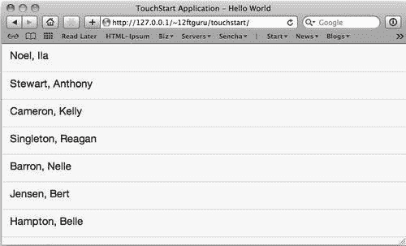

现在，我们需要在 `detailsPanel`组件中添加数据。让我们从简单的第一部分开始，在列表后面添加一个新的 `panel`项：

```js
{
xtype: 'panel',
id: 'detailsPanel',
tpl: '{first} {last}<br>{address}<br>{city}, {state} {zip}<br>{email}<br>{birthday}',
dockedItems: [{
xtype: 'toolbar',
dock: 'top',
items: [{
text: 'Back',
ui: 'back',
handler: function() {
Ext.getCmp('cardStack').setActiveItem(0);
}
}]
}]
}

```

在这里，我们只需设置 `id`，以便在需要时抓住面板。我们还添加了一个简单的模板。我们包括一些 HTML 换行符，以便更好地布局数据。最后，我们添加一个 `Back`按钮，它将把我们带回主列表。

我们需要做的最后一件事是向列表中添加一个侦听器，以便将数据加载到面板中：

```js
listeners: {
itemTap: {
fn: function(list,index){
var record = list.getStore().getAt(index);
Ext.getCmp('detailsPanel').update(record.data);
Ext.getCmp('cardStack').setActiveItem(1);
}
}
}

```

这样做的好处是，我们实际上不需要加载任何新的内容。列表已经可以通过数据存储访问所有额外数据。我们只需抓取存储并使用作为 `itemTap`组件一部分传递的 `index`对象。然后，我们从 `record`变量获取数据，并将其作为 `update`函数的一部分传递给面板。最后，我们将活动项设置为我们的 `detailsPanel`组件。当我们点击列表中的项目时，结果如下所示：

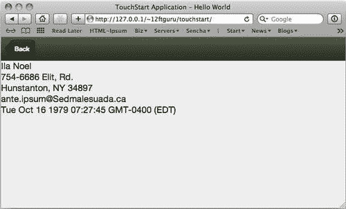

`detailsPanel`组件不仅包括我们列表中的名字和姓氏，还包括地址、电子邮件和生日数据。所有这些数据都来自同一个数据存储；我们只需使用模板来选择要显示的片段。

说到模板，我们的模板看起来有点单调，生日比我们真正需要的要具体一些。我们一定能做点什么把它打扮一下。

# XTemplates

正如我们从前面的许多示例中看到的，**XTemplate**是一种包含 HTML 布局信息和数据占位符的结构。

到目前为止，我们只为列表和面板创建了非常基本的模板，使用了数据值和一些 HTML。我们还将它们创建为组件本身的一部分，作为单个字符串。这可能很快变得笨拙。但是，我们也可以将这些模板设置为单独的组件：

```js
var myTemplate = new Ext.XTemplate(
'{first} {last}<br>',
'{address}<br>',
'{city}, {state} {zip}<br>',
'{email}<br>',
'{birthday}'
);

```

这将创建一个与以前完全相同的模板。在这种配置中，阅读和维护要容易得多。在这里，我们可以有任意多行，用引号括起来，用逗号分隔。

然后，我们可以使用 `tpl: myTemplate`将其添加到我们的面板中。

这使我们能够轻松创建比旧模板更漂亮的内容：

```js
var myTemplate = new Ext.XTemplate(
'<div style="padding:10px;"><b>{first} {last}</b><br>',
'{address}<br>',
'{city}, {state} {zip}<br>',
'<a href="mailto:{email}">{email}</a><br>',
'{birthday}</div>'
);

```

这使我们的显示器看起来更好一些。

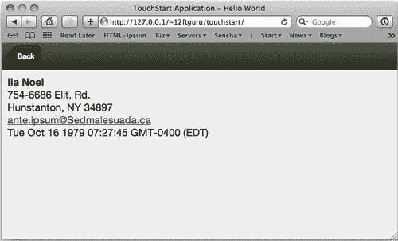

我们还可以在主列表中使用这些相同类型的 XTemplates，使其更具风格。例如，添加以下内容作为我们列表的 `itemTpl`组件将在列表中的每个名字旁边放置一张可爱的小猫图片：

```js
var listTemplate = new Ext.XTemplate(
'<div class="contact-wrap" id="{first}-{last}">',
'<div class="thumb" style= "float: left;"></div>',
'<span class="contact-name">{first} {last}</span></div>'
);

```

对于这个例子，我们只是添加了一些 HTML 来布局每一行数据，然后使用随机图像生成服务来放置一张 36 x 36 的随机小猫图片，它将排列在左边我们的名字旁边。（您也可以使用它来显示联系人的图片）。

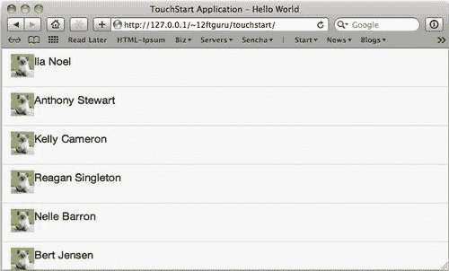

在这一点上，我们仍然只是在玩基本的 HTML，但是 XTemplates 比它强大得多。

## 数据处理

由于 XTemplates 是 Sencha Touch 中的组件，因此它们允许我们以多种方式直接操作模板中的数据。我们能做的第一件事就是清理那个丑陋的生日。

因为生日在我们的模型中被列为一个 `date`对象，所以我们可以在模板中将其视为一个。我们可以将模板的当前生日行替换为以下内容：

```js
'Birthday: {birthday:date("n/j/Y")}</div>'

```

这将使用我们的值 `birthday`，格式函数 `date. date`使用字符串 `"n/j/Y`将 `birthday`转换为更可读的格式。这些格式字符串可以在 Sencha Touch API 的日期页面上找到。

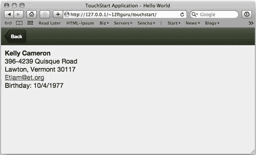

Sencha Touch 包括许多可以以这种方式使用的格式化功能。一些功能包括：

*   `date:`使用指定的格式字符串格式化 `date`对象（格式字符串可在 Sencha Touch API 的日期页面上找到）。
*   `ellipsis:`将字符串截断为指定长度，并在末尾添加 `...`（注意 `...`被视为总长度的一部分）。
*   `htmlEncode`和 `htmlDecode:`将 HTML 字符（&、`<, >`和`')`转换为 HTML。
*   `leftPad:`用指定字符填充字符串的左侧（适用于用前导零填充数字）。
*   `toggle:`在两个交替值之间切换的实用功能。
*   `trim:`删除字符串开头和结尾的所有空白。它使字符串中的空格保持不变。

基本函数可以在 XTemplate 的 HTML 中用于格式化数据。但是，XTemplate 还有一些额外的技巧。

## 数据循环

在列表视图中， `itemTpl`组件的 XTemplate 自动应用于列表中的每个项目。但是，您也可以使用以下语法手动循环数据：

```js
'<tpl for=".">',
'{name}</br>',
'</tpl>'

```

当您使用`<tpl>`标记时，它会告诉 XTemplate 我们正在退出 HTML 领域并在模板中做出一些决策。在本例中，`<tpl for=".">`告诉代码启动一个循环并使用数据的根节点。关闭`</tpl>`指示循环停止。

由于我们可以使用 XML 和 JSON 创建复杂的嵌套数据，因此在根节点之外的位置循环数据也会很有帮助。例如，假设我们有一个州数组，每个州包含一个城市数组。我们可以按如下方式循环使用这些数据：

```js
'<tpl for=".">',
'{name}</br>',
'<tpl for="cities">',
'{name}</br>',
'</tpl>'
'</tpl>'

```

我们的第一个`<tpl>`标签开始在我们各州循环，打印名称。打印名称后，它会在单个状态中查找一个子数组，称为 `cities`。

这一次，当我们使用变量 `{name}`时，它在我们的子循环中，因此它在进入循环中的下一个状态之前打印该州每个城市的名称。

### 注

请注意，当我们在`<tpl>`标记中使用字段名时，我们不会像这样使用花括号： `{cities}`。由于我们在模板的 HTML 部分之外，Sencha Touch 假定 `"cities`是一个变量。

我们甚至可以通过添加另一个循环来访问嵌套在每个城市中的数组，例如邮政编码：

```js
'<tpl for=".">',
'{name}</br>',
'<tpl for="cities">',
'{name}</br>',
'<tpl for="cities.postal">',
'{code}</br>',
'</tpl>'
'</tpl>'
'</tpl>'

```

在本例中，我们使用了`<tpl for="cities.postal">`来表示我们将在 cities 数据数组中遍历 postal codes 数据数组。我们的其他数组循环与以前一样执行。

### 循环内的编号

当您在循环中工作时，能够计算循环中的周期通常很有帮助。您可以在 XTemplate:中使用 `{#}`来实现这一点

```js
'<tpl for=".">',
'{#} {name}</br>',
'</tpl>'

```

这将打印循环中每个名称旁边的当前循环编号。这将以类似的方式用于嵌套数据：

```js
'<tpl for=".">',
'{#} {name}</br>',
'<tpl for="cities">',
'{#} {name}</br>',
'</tpl>'
'</tpl>'

```

第一个 `{#}`将显示我们在主循环中的位置，第二个 `{#}`将显示我们在 `cities`循环中的位置。

### 循环中的父数据

在有嵌套数据的情况下，能够从子循环中获取父属性也会很有帮助。您可以通过使用 `parent`对象来实现这一点。使用州、市和县的嵌套示例，如下所示：

```js
'<tpl for=".">',
'{name}</br>',
'<tpl for="cities">',
'{parent.name} - {name}</br>',
'<tpl for="cities.postal">',
'{parent.name} - {code}</br>',
'</tpl>'
'</tpl>'
'</tpl>'

```

在我们的 `cities`循环中， `{parent.name}`将显示该城市的州名。当我们进入 `cities.postal`循环时， `{parent.name}`将显示与该邮政编码关联的城市名称。

使用此 `{parent.fieldname}`语法，我们可以从当前子项中获取父项的任何值。

## 条件显示

除了循环之外，XTemplates 还提供一些有限的条件逻辑，用于模板中。这是有限的，因为 Sencha Touch 不提供熟悉的编程概念 `if...else...then`，只提供 `if...then`。例如，在我们的州和城市中，我们可以使用 `if`语句仅显示人口超过 2000 的城市：

```js
'<tpl for=".">',
'{name}</br>',
'<tpl for="cities">',
'<tpl if="population &gt; 2000">',
'{name}</br>',
'</tpl>',
'</tpl>',
'</tpl>'

```

如果我们想根据 cites 是否超过或低于我们的人口目标对其进行颜色编码，那么我们不能使用 `if... else... then`。我们必须将其作为两种相反的 `if`陈述：

```js
'<tpl for=".">',
'{name}</br>',
'<tpl for="cities">',
'<tpl if="population &gt; 2000">',
'<div class="blue">{name}</div>',
'</tpl>',
'<tpl if="population &lt; 2000">',
'<div class="red">{name}</div>',
'</tpl>',
'</tpl>',
'</tpl>'

```

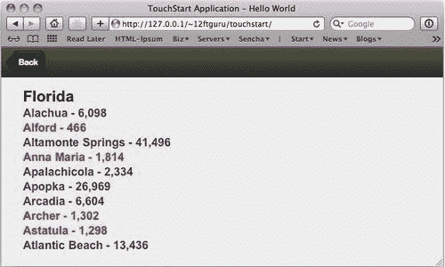

现在，你可能已经在问自己为什么我们要使用`&gt`；和`&lt`；而不是`>`和`<`。原因是我们的条件语句中的任何内容都需要进行 HTML 编码，以便 XTemplate 正确解析它。一开始可能会有点困惑，但需要记住的关键事项如下：

*   使用`&gt`；而不是`>`。
*   使用`&lt`；而不是`<`。
*   使用 equals as normal `==`但是，如果要比较字符串值，则必须转义单引号，如：`'<tpl if="state == \'PA\'">'`。
*   您需要对`", if it is part of your conditional. So if you are searching for the word `"spam`进行编码，包括引号，您必须对 `as&quot;spam&quot`进行编码；。`

 `## 算术

除了条件逻辑外，XTemplates 还支持以下基本数学功能：

*   加法（+）
*   减法（-）
*   乘法（*）
*   分部（/）
*   模数一个数除以另一个数的余数（%）

例如：

```js
'<tpl for=".">',
'{name}</br>',
'<tpl for="cities">',
'{name}</br>',
'Population: {population}</br>',
'Projected Population for next year: {population * 1.15}</br>',
'</tpl>',
'</tpl>'

```

这将为我们提供初始人口值，然后是当前人口的 1.15 倍的预测人口。数学函数包含在变量周围的大括号内。

## 内联 JavaScript

我们还可以在 Xtemplate 中执行任意内联代码。我们可以将代码放在括号和大括号的组合中： `{[...]}`。在这段代码中，我们还可以访问一些特殊属性：

*   `values:`当前范围内的数值
*   `parent:`当前父对象的值
*   `xindex:`您所在环路的当前索引
*   `xcount:`当前回路中的项目总数

例如，我们可以确保我们的州和城市名称为大写，并在城市列表中使用以下 XTemplate 替换颜色：

```js
'<tpl for=".">',
'{[values.name.toUpperCase()]}</br>',
'<tpl for="cities">',
'<div class="{[xindex % 2 === 0 ? "even" : "odd"]}">',
'{[values.name.toUpperCase()]}</br>',
'</div>',
'</tpl>',
'</tpl>'

```

在本例中，我们使用 `{[values.name.toUpperCase()]}`强制州和城市的名称为大写。我们还使用 `{[xindex % 2 === 0 ? "even" : "odd"]}`根据当前计数的剩余部分除以 `2`（模数）来交替行颜色。

即使能够编写内联 JavaScript，在许多情况下，您可能需要更健壮的东西。这就是 XTemplate 成员函数发挥作用的地方。

## XTemplate 成员函数

XTemplate 成员函数允许您将 JavaScript 函数附加到 XTemplate，然后通过调用 `this.function_name`在模板内执行它。

函数将添加到模板的末尾，模板可以包含多个成员函数。这些成员函数以类似侦听器的方式包装在一组大括号中：

```js
{
myTemplateFunction: function(myVariable) {
...
},
myOtherTemplateFunction: function() {
...
}
}

```

我们可以使用这些成员函数来弥补模板中本机 `if...then...else`选项的不足。让我们使用前面的州和城市示例，稍微扩展一下颜色编码。

```js
'<tpl for=".">',
'{name}</br>',
'<tpl for="cities">',
'<div class="{[this.setPopulationStyle(values.population)]}">{name}</div>',
'</tpl>',
'</tpl>',
'</tpl>',
{
setPopulationStyle: function(population) {
if(population >= 4000) {
return 'red';
} else if(population <= 3999 && population >= 2000) {
return 'orange';
} else if(population <= 1999&& population >= 1000) {
return 'blue';
} else {
return 'grey';
}
}
}

```

在这个例子中，我们创建了一个名为 `setPopulationStyle`的成员函数，我们将人口变量传递给它。因为我们的函数可以执行我们想要的任何 JavaScript，所以我们可以在这里使用我们的 `if...then...else`逻辑，在模板中为我们的群体设置一个类。然后，我们可以使用 `{[this.setPopulationStyle(values.population)]}`调用模板内的函数，该函数将根据我们的总体值打印出我们的类名。

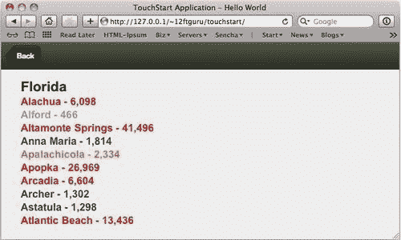

我们还可以使用我们的成员函数来帮助我们测试数据的存在与否。这对于控制模板非常方便。例如，让我们从姓名、地址和电子邮件的联系人模板开始，例如：

```js
var myTemplate = new Ext.XTemplate(
'<div style="padding:10px;"><b>{first} {last}</b><br>',
'{address}<br>',
'{city}, {state} {zip}<br>',
'<a href="mailto:{email}">{email}</a><br>',
'Birthday: {birthday:date("n/j/Y")}</div>'
);

```

如果我们没有地址、城市和州的数据，我们将得到一些空行和一个多余的逗号。根据我们的模型，由于我们的 `zip`变量是一个整数，如果我们没有为其存储值，它将显示为**0**。

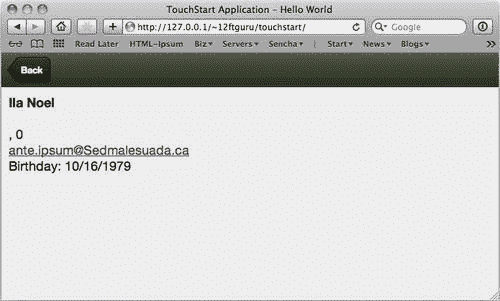

在打印之前，我们需要一种检查并查看是否有这些项目的数据的方法。

### 我是空的

事实证明，当检测空值时，本机 JavaScript 是非常有问题的。根据函数的不同，JavaScript 可能会返回以下内容：

*   无效的
*   未定义
*   空数组
*   空字符串

对我们大多数人来说，这几乎是一回事；我们什么也没拿回来。然而，对于 JavaScript，这些返回值是非常不同的。如果我们尝试使用 `if(myVar == '')`测试数据，但返回 null、undefined 或空数组，JavaScript 将返回 false。

幸运的是，Sencha Touch 有一个名为 `isEmpty()`的便捷小功能。此函数将在一个函数中测试 null、未定义、空数组和空字符串。然而，Sencha Touch 对 `has data`没有相反的功能，这正是我们真正想要测试的。由于模板成员函数，我们可以编写自己的模板。

```js
var myTemplate = new Ext.XTemplate(
'<div style="padding:10px;"><b>{first} {last}</b><br>',
'<tpl if="!Ext.isEmpty(address)">',
'{address}<br>',
'{city}, {state} {zip}<br>',
'</tpl>',
'<a href="mailto:{email}">{email}</a><br>',
'Birthday: {birthday:date("n/j/Y")}</div>'

```

我们甚至不需要用于此数据检查的成员函数。我们可以将`<tpl if="!Ext.isEmpty(address)">`添加到我们的模板中，并根据我们的模板检查地址。 `Ext.isEmptyfunction`类获取地址数据并检查其是否为 `!`（空）。如果地址不是空的，我们打印地址，如果地址是空的，我们什么也不做。

## 使用 XTemplate.overwrite 更改面板内容

在前面的示例中，我们已经使用 `tpl`或 `itemtpl`将 XTemplate 声明为面板或列表的一部分。但是，在显示列表或面板后，以编程方式覆盖模板也会有所帮助。您可以通过声明一个新模板，然后使用面板（或列表）的 `overwrite`命令组合模板和数据，并覆盖面板或列表的内容区域来完成此操作。

```js
var myTemplate = new Ext.XTemplate(
'<tpl for=".">',
'{name}</br>',
'<tpl for="cities">',
'- {name}<br>',
'</tpl>',
'</tpl>',
'</tpl>'
);
myTemplate.overwrite(panel.body, data);

```

我们的 `overwrite`函数将一个元素（Ext 或 `HTML)`作为第一个参数。因此，我们需要使用面板的 body 元素作为 `panel.body`，而不是仅仅使用 panel。然后我们可以从数据存储或值数组中提供一条记录，作为新模板使用的第二个参数。

虽然 XTemplates 是显示数据的一种非常强大的方式，但它们仍然非常繁重。如果我们想把数据显示得更丰富一点呢？让我们看看森查触摸图。

# 森查触摸图

到目前为止，我们只将数据存储和记录视为显示文本数据的一种方式，但随着 Sencha Touch Charts 的发布，我们现在能够将复杂的图形数据显示为应用的一部分。

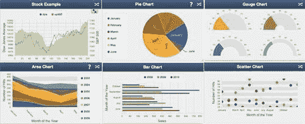

这些新组件使用数据存储来显示各种图表和图形类型，包括以下内容：

*   馅饼
*   酒吧
*   线
*   分散
*   系列
*   树形图
*   世界地图

虽然对图表组件的全面探索本身就值得一本书，但我们想提供这些组件如何与数据存储交互的概述，希望能激发您的好奇心。

## 安装触摸图

Sencha Touch 图表是从 Sencha Touch 主框架中单独下载的，您可以在[找到它们 http://www.sencha.com/products/touch/charts/](http://www.sencha.com/products/touch/charts/) 。

您需要解压 `touch-charts`文件夹并将其移动到您的文件夹中，这与我们在[第 2 章](2.html "Chapter 2. Creating a Simple Application")中设置 Sencha Touch 框架的方式非常相似，*创建一个简单的应用*。您还需要在主 `index.html`文件中包含 `touch-charts-debug.js`和 `touch-charts-demo.css`文件（两个文件都在 `touch-charts`文件夹中）。按照前面的[第 2 章](2.html "Chapter 2. Creating a Simple Application")*中的说明创建一个简单的应用*，用于包含 JavaScript 文件。

## 简单的饼图

一旦包含了这些文件，我们就可以为我们的图表示例启动一个新的 JavaScript 文件。我们将从一个数据存储开始：

```js
Ext.setup({
onReady: function() {
var mystore = new Ext.data.JsonStore({
fields: ['month', 'sales'],
data: [
{'month': 'June', 'sales': 500},
{'month': 'July', 'sales': 350},
{'month': 'August', 'sales': 200},
{'month': 'September', 'sales': 770},
{'month': 'October', 'sales': 170}
]
});
}
});

```

我们的存储声明了两种字段类型， `month`和 `sales`，我们的数据数组包含五组 `month`和 `sales`值。这将输入到我们的饼图中：

```js
var chartPanel = new Ext.chart.Panel({
title: 'Pie Chart',
fullscreen: true,
items: {
cls: 'pie1',
theme: 'Demo',
store: mystore,
insetPadding: 20,
legend: {
position: {
portrait: 'bottom',
landscape: 'left'
}
},
series: [{
type: 'pie',
field: 'sales',
showInLegend: true,
label: {
field: 'month'
}
}]
simple pie chart}
});

```

与我们的其他面板组件非常相似， `Ext.chart.Panel`类采用 `title`和 `fullscreen`的配置。它还需要包含在面板主体中的项目列表。如果是图表面板，则该项将是单个 `chart`组件。

`chart`组件采用 `cls`（CSS 类）、 `theme`、数据 `store`组件和 `insetPadding`组件的配置选项，以防止图表撞到页面顶部和侧面。

接下来，我们有一个 `legend`图表的配置。这为所有图表值提供了颜色编码的参考。我们可以使用位置配置来指定图例在纵向和横向模式下的显示方式。

最后一件是我们的 `series`配置。在我们的示例中，我们设置了将看到的图表类型、图表用于绘制饼图切片的字段、是否显示图例，以及最后一个将用于图例的标签。

### 提示

**系列配置**

系列配置控制图表的大部分外观：阴影、动画处理、渐变，以及我们想要的图表的实际类型（饼图、列、条形图、散点图等等）。一个系列将由一系列项目组成，这些项目控制每个图表元素的位置以及用于该元素的存储的值。这也意味着每种类型的图表对其系列数据的要求和选项略有不同。参考 API 图纸和图表文档，查看不同类型系列配置的示例：[http://docs.sencha.com/touch-charts/1-0/#!/指南/图纸和图表](http://docs.sencha.com/touch-charts/1-0/#!/guide/drawing_and_charting)。

当我们全部加载时，我们的图表如下所示：

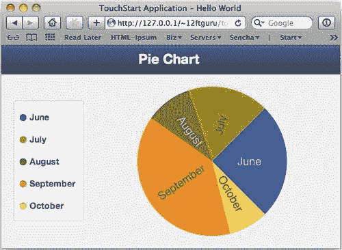

如果单击图例上的任何月份，可以在图表中打开或关闭它们。此功能自动执行，无需任何附加代码。

饼图适用于非常简单的单系列数据，但如果我们有几年的数据会发生什么？让我们看看条形图如何显示此类数据。

## 条形图

对于我们的条形图，让我们将图表数据存储替换为以下内容：

```js
var mystore = new Ext.data.JsonStore({
fields: ['month', 'data'],
data: [
{'month': 'June', '2008': 500, '2009': 400, '2010': 570},
{'month': 'July', '2008': 350, '2009': 430, '2010': 270},
{'month': 'August', '2008': 200, '2009': 300, '2010': 320},
{'month': 'September', '2008': 770, '2009': 390, '2010': 670},
{'month': 'October', '2008': 170, '2009': 220, '2010': 360}
]
});

```

此数据集包含我们需要显示的多个数据系列（五个月，每个月三年）。一个有效的条形图需要为每个月显示一行，并在每个月内为我们的每一年显示单独的条形图。

我们可以先将图表面板的标题更改为*条形图*。然后，我们可以替换图表项，如下所示：

```js
items: {
cls: 'bar1',
theme: 'Demo',
store: mystore,
animate: true,
legend: {
position: {
portrait: 'right',
landscape: 'top'
},
labelFont: '17px Arial'
},
axes: [{
type: 'Numeric',
position: 'bottom',
fields: ['2008', '2009', '2010'],
title: 'Sales',
minimum: 0
},
{
type: 'Category',
position: 'left',
fields: ['month'],
title: 'Month of the Year'
}],
series: [{
type: 'bar',
xField: 'month',
yField: ['2008', '2009', '2010'],
axis: 'bottom',
showInLegend: true
}]
}

```

与我们的饼图一样，条形图组件采用 `cls`（CSS 类）、 `theme`、数据 `store`和新选项 `animate`的配置选项。当我们打开和关闭图例中的不同项目时，此选项将使条形图具有动画效果。

然后，我们像以前一样创建了图例，后面是一个名为 `axes`的新配置选项。由于条形图沿 X 轴和 Y 轴运行，因此我们需要指定哪些数据点应向每个轴馈电。

首先是我们每年的销售数据。数据为数字，位于底部，标题为 `sales`。我们还指定将用于此访问的字段以及最小值（这是将显示在条形图最左侧的数字，通常为零）。

下一个轴是我们的类别数据（也将用于我们的图例）。在这种情况下，我们的 `position`是 `left`，我们的 `field`是 `month`，我们的 `title`是 `Month of the Year`。这结束了我们的 `axes`配置。

最后，我们有了 `series`配置，它将此设置为条形图。与我们前面的饼图示例不同，它只跟踪销售数据，条形图跟踪两个独立点（月份和 `year)`的销售数据，因此我们需要分配 `xField`和 `yField`变量，并声明一个轴位置。此位置应与显示数字数据的轴相匹配（在我们的例子中，数据在 Y 轴上，Y 轴在底部）。我们使用 `showInLegend`来显示我们的图例。

最终图表应如下所示：

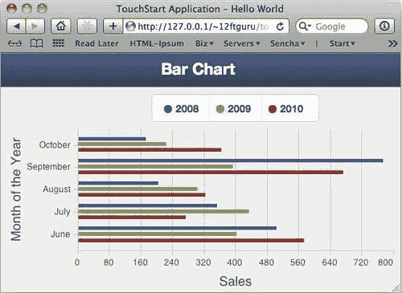

### 注

图表是使用存储来显示数据的一种非常强大的方式，我们没有时间在这里一一介绍，但您可以在[探索 Sencha 图表的所有功能 http://www.sencha.com/products/touch/charts/](http://www.sencha.com/products/touch/charts/) 。

您也可以在[找到每种图表的示例 http://dev.sencha.com/deploy/touch-charts-1.0.0/examples/](http://dev.sencha.com/deploy/touch-charts-1.0.0/examples/) 。请记住，您需要使用 WebKit 浏览器（Safari 或 Chrome）查看这些示例。

完整触控图表 API 文档可在[获取 http://docs.sencha.com/touch-charts/1-0/](http://docs.sencha.com/touch-charts/1-0/) 。

# 总结

在本章中，我们探讨了如何使用数据存储来显示简单数据和复杂数据。我们讨论了绑定、排序、分页和加载数据存储。然后，我们将数据存储与列表和面板一起使用。

我们介绍了如何通过使用 XTemplates 来控制存储和记录中的数据的显示方式来布局应用。我们探讨了如何在 XTemplate 中操纵和循环数据，以及如何使用条件逻辑、算术和内联 JavaScript。通过讨论成员函数及其一些用法，我们结束了关于 XTemplates 的对话。

我们以使用 Sencha Touch Charts 软件包以图形方式显示我们的店铺数据来结束本章。

在下一章中，我们将探讨如何将前几章中的所有信息整合到一个全面的应用中。`